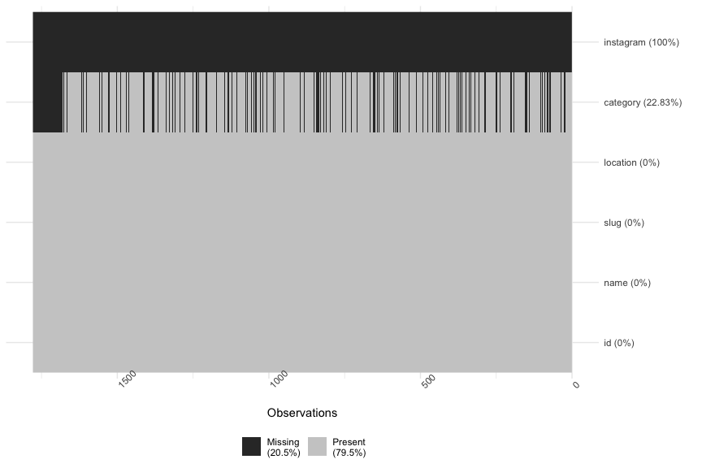
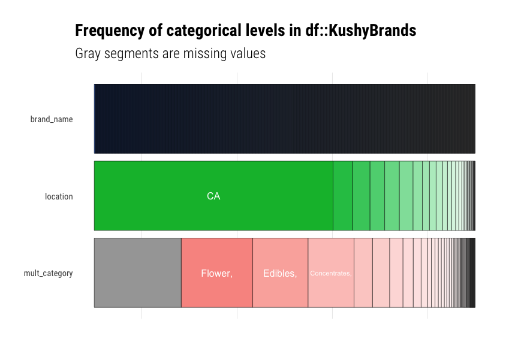
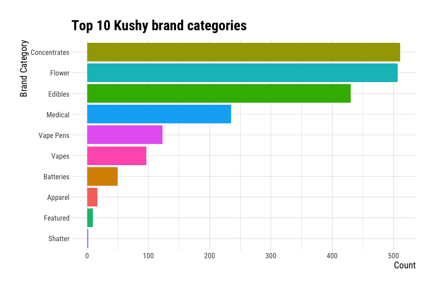
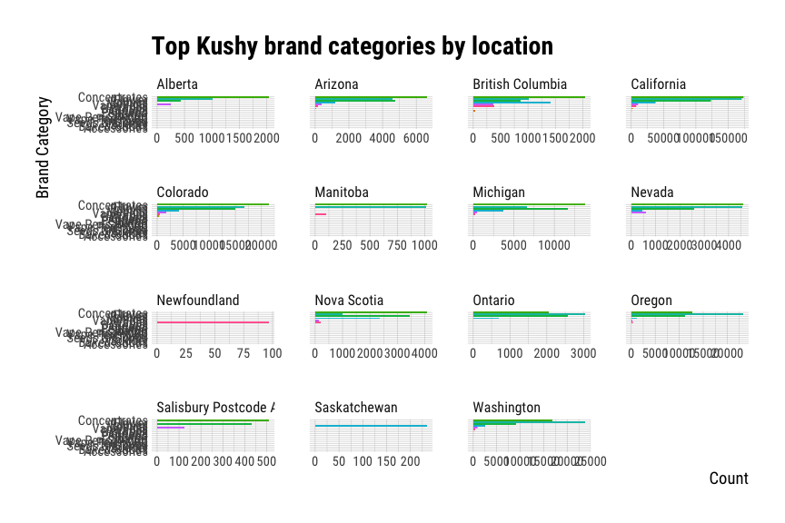
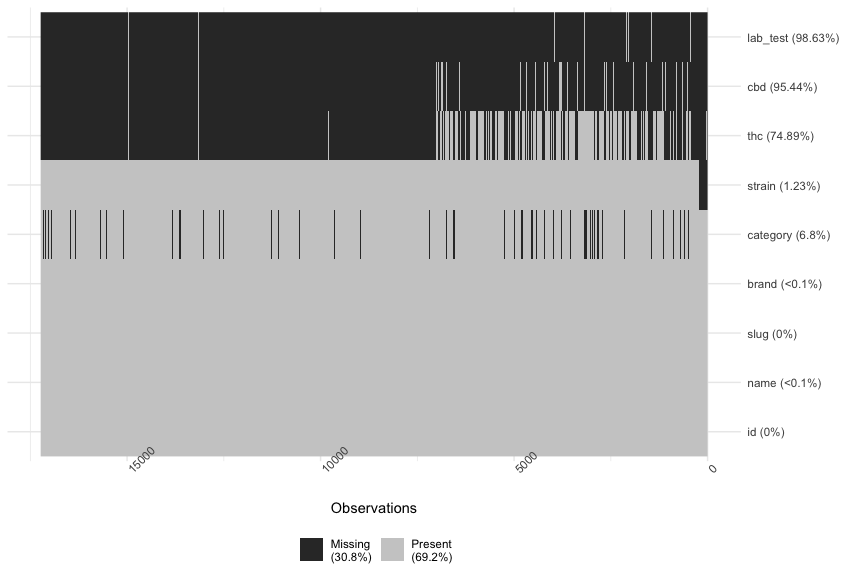
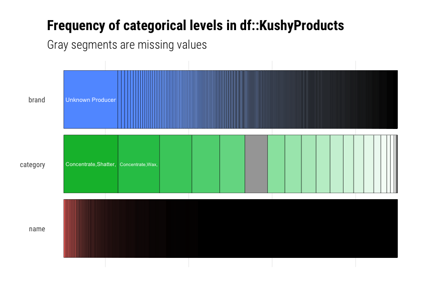

README - Wrangling Cannabis Data Sets
================
Martin Frigaard
current version: 2020-06-27

# Motivation

This script outlines the steps to wrangle the Cannabis data. We
initially used an open online retail data set from the [UCI Machine
Learning
Laboratory](https://archive.ics.uci.edu/ml/datasets/online+retail) for
the week-over-week visualizations (`OnlineRetail`), and combined this
with categories from the
[`kushyapp`](https://github.com/kushyapp/cannabis-dataset).

# The data

All of the data are in the `data/` folder.

    #>  data/
    #>  ├── README.md
    #>  ├── kushy-datasets
    #>  ├── online-retail
    #>  └── processed

## Import the Kushy data

These data sets provide the categories and brands from the Cannabis
industry.

    #>  data/kushy-datasets/csv/brands-kushy_api.2017-11-14.csv
    #>  data/kushy-datasets/csv/products-kushy_api.2017-11-14.csv
    #>  data/kushy-datasets/csv/shops-kushy_api.2017-11-14.csv
    #>  data/kushy-datasets/csv/strains-kushy_api.2017-11-14.csv

Import these files.

## Kushy Brands

These are the brands in the `KushyBrands` data frame. I want to see how
many unique brands are represented here, but first I need to know what I
am dealing with in terms of completeness. I can check this with `skimr`

<!-- -->

This shows I can remove the `instagram` variable, and the `category`
variable is missing `406` values. Hopefully this won’t an issue. We can
do without the `slug` too.

<!-- -->

Now I can check the unique `name`s for each brand. These are stored in
the `brand_name` variable.

### The Kushy brand names

These are the brand names in the `KushyBrands` data frame.

    #>  # A tibble: 1,776 x 2
    #>     brand_name                        n
    #>     <chr>                         <int>
    #>   1 Brewbudz by Cannabiniers          2
    #>   2 Dixie Elixirs & Edibles           2
    #>   3 #1 Suspect Extracts               1
    #>   4 1 World Medicinals                1
    #>   5 1906 Chocolates                   1
    #>   6 1906 New Highs                    1
    #>   7 2020 Creations                    1
    #>   8 2020 Future Pre Rolls             1
    #>   9 2020 Knockout Pre Roll Sticks     1
    #>  10 2020 Medi Mudd                    1
    #>  # … with 1,766 more rows

The output above shows us there are `1776` unique observations in the
`name` variable, but two of them (`Brewbudz by Cannabiniers` and `Dixie
Elixirs & Edibles`) appear more than once.

### Kushy brand categories

When we look at the categories we see that there are multiple categories
(`mult_category`) crammed into a single column separated by commas.

    #>  # A tibble: 10 x 4
    #>        id brand_name                 location mult_category                    
    #>     <dbl> <chr>                      <chr>    <chr>                            
    #>   1     1 #1 Suspect Extracts        CA       Concentrates,                    
    #>   2     2 1 World Medicinals         CA       Flower, Concentrates, Edibles, M…
    #>   3     3 1906 New Highs             CO       Edibles,                         
    #>   4     4 2020 Creations             CA       Concentrates,                    
    #>   5     5 2020 Future Pre Rolls      CA       Flower,                          
    #>   6     6 2020 Knockout Pre Roll St… CA       Flower,                          
    #>   7     7 2020 Medi Mudd             Ca       Edibles,                         
    #>   8     8 2020 Private Reserve Pre … CA       Flower,                          
    #>   9     9 23 Oils                    CA       Concentrates,                    
    #>  10    10 24 KARAT EXTRACTIONS (CAN… CA       Concentrates,

We want to separate each category out into an individual rows, because
`category` *might* be useful for itemizing products later. The
categories are currently separated by commas, but we can split them up
and separate the rows with `tidyr::separate_rows()`. We also need to
remove the whitespace from the `category` variable, and remove any rows
(with other quotes).

    #>  Rows: 1,988
    #>  Columns: 4
    #>  $ id             <dbl> 1, 2, 2, 2, 2, 3, 4, 5, 6, 7, 8, 9, 10, 11, 12, 13, …
    #>  $ brand_name     <chr> "#1 Suspect Extracts", "1 World Medicinals", "1 Worl…
    #>  $ location       <chr> "CA", "CA", "CA", "CA", "CA", "CO", "CA", "CA", "CA"…
    #>  $ brand_category <chr> "Concentrates", "Flower", "Concentrates", "Edibles",…

We’ve just changed the number of rows in this data frame from `1778` to
`1988` because we’ve added a new row for each category, and these were
previously on a single row (separated by a commas). If we count the
number of names now, we can see there are more counts in the `n` column.

    #>  # A tibble: 10 x 2
    #>     brand_name                    n
    #>     <chr>                     <int>
    #>   1 BaM                           5
    #>   2 Clean Concentrates            5
    #>   3 Colorado Cannabis Company     5
    #>   4 Evergreen Organix             5
    #>   5 FlavRX                        5
    #>   6 The Clear Concentrate         5
    #>   7 The Legion of Bloom           5
    #>   8 Vapen                         5
    #>   9 1 World Medicinals            4
    #>  10 AbsoluteXtracts               4

    #>  # A tibble: 10 x 2
    #>     brand_name                        n
    #>     <chr>                         <int>
    #>   1 Brewbudz by Cannabiniers          2
    #>   2 Dixie Elixirs & Edibles           2
    #>   3 #1 Suspect Extracts               1
    #>   4 1 World Medicinals                1
    #>   5 1906 Chocolates                   1
    #>   6 1906 New Highs                    1
    #>   7 2020 Creations                    1
    #>   8 2020 Future Pre Rolls             1
    #>   9 2020 Knockout Pre Roll Sticks     1
    #>  10 2020 Medi Mudd                    1

These are the counts for each name (products and brands), and we can see
there are fewer names in the `TidyBrandCat` data frame than the
`KushyBrands` data frame.

#### Verify the BaM case study

Check the `BaM` case study to see if there are multiple categories for
this brand.

    #>  # A tibble: 1 x 4
    #>       id brand_name location mult_category                                     
    #>    <dbl> <chr>      <chr>    <chr>                                             
    #>  1   107 BaM        NV       Flower, Concentrates, Vape Pens, Edibles, Medical,

And we can see there are four comma-separated categories in the
`KushyBrands` data, and the same four categories are in the
`TidyBrandCat`.

    #>  # A tibble: 5 x 4
    #>       id brand_name location brand_category
    #>    <dbl> <chr>      <chr>    <chr>         
    #>  1   107 BaM        NV       Flower        
    #>  2   107 BaM        NV       Concentrates  
    #>  3   107 BaM        NV       Vape Pens     
    #>  4   107 BaM        NV       Edibles       
    #>  5   107 BaM        NV       Medical

This shows us there are five categories for `BaM` in `KushyBrands`, and
five categories for `BaM` in `TidyBrandCat`. Now we can check the top
brand categories.

## Top Brand Categories

When we check the top categories in the brands table, we see there are
mostly `Concentrates`, `Flower`, and `Edibles`.

<!-- -->

We will still want to use the `location` to replace the `country`
variable in the online retail data.

## Unique locations

These are the unique locations in the `TidyBrandCat` dataset.

    #>  
    #>  Attaching package: 'magrittr'

    #>  The following object is masked from 'package:purrr':
    #>  
    #>      set_names

    #>  The following object is masked from 'package:tidyr':
    #>  
    #>      extract

    #>   [1] "CA"               "CO"               "Ca"               "California"      
    #>   [5] "OR"               "BC"               "MI"               "NV"              
    #>   [9] "Wa"               "Oregon"           "AZ"               "WA"              
    #>  [13] "Co"               "CALIFORNIA"       "ON"               "Or"              
    #>  [17] "British Columbia" "Az"               "Colorado"         "Arizona"         
    #>  [21] "AB"               "Nv"               "NS"               "Washington"      
    #>  [25] "Michigan"         "MB"               "Pleasant Hill"    "NL"              
    #>  [29] "ca"               "Sp"

We will make this a little cleaner for the graphs.

Here we can visualize the top brand categories by their `location`.

<!-- -->

Now we can see the vast majority of these are from `California`. We will
look to join this with the product data below. We’ll reduce this dataset
to only the

-----

## Kushy Product Data

The kushy products are stored in the `KushyProducts` data frame. These
might be a better candidate for binding to the online retail data.

<!-- -->

We can remove the `slug`, `strain`, `thc`, `cbd`, `lab_test`.

    #>  Rows: 17,233
    #>  Columns: 4
    #>  $ id       <dbl> 1, 2, 3, 4, 5, 6, 7, 8, 9, 10, 11, 12, 13, 14, 15, 16, 17,…
    #>  $ name     <chr> "Pre-Roll Package - Pre-roll", "ounce of cannabis", "1/2 o…
    #>  $ brand    <chr> "The Humboldt Cure", "The Humboldt Cure", "The Humboldt Cu…
    #>  $ category <chr> "Flowers,Pre-Roll", NA, NA, NA, NA, NA, "Flowers,Pre-Roll"…

How we can check the character variables in the data frame.

<!-- -->

We will check the count of `name`s first.

#### Product `name`

The `name` for each product is below.

    #>  # A tibble: 10 x 2
    #>     name                                 n
    #>     <chr>                            <int>
    #>   1 Sour Diesel - Shatter               74
    #>   2 OG Kush - Shatter                   57
    #>   3 Girl Scout Cookies - Shatter        49
    #>   4 Girl Scout Cookies - Wax            48
    #>   5 Sour Diesel - Oil                   45
    #>   6 Sour Diesel - Wax                   45
    #>   7 Blue Dream - Shatter                43
    #>   8 Gorilla Glue #4 - Shatter           42
    #>   9 OG Kush - Vaporizer Cartridge       39
    #>  10 Blue Dream - Vaporizer Cartridge    38

### Separate product name and product details

I am going to separate these terms by the hyphen `-` and create a
`product_name` variable and `product_details` variable. These two can be
used to clean up the products into categories and their names.

    #>  # A tibble: 10 x 4
    #>     name                  product_name         product_details product_category
    #>     <chr>                 <chr>                <chr>           <chr>           
    #>   1 Pre-Roll Package - P… "Pre-Roll Package"   Pre-roll        Flowers,Pre-Roll
    #>   2 ounce of cannabis     "ounce of cannabis"  <NA>            <NA>            
    #>   3 1/2 ounce of cannabis "1/2 ounce of canna… <NA>            <NA>            
    #>   4 1/4 ounce of cannabis "1/4 ounce of canna… <NA>            <NA>            
    #>   5 1/8                   "1/8"                <NA>            <NA>            
    #>   6 Nectar Box-The Humbo… "Nectar Box-The Hum… <NA>            <NA>            
    #>   7 The Humboldt Cure  -… "The Humboldt Cure " Pre-roll        Flowers,Pre-Roll
    #>   8 CBD-Rich Recovery Sa… "CBD-Rich Recovery … 5ml Sample      Topical,        
    #>   9 CBD-Rich Recovery Sa… "CBD-Rich Recovery … <NA>            Topical,        
    #>  10 Lift Tickets Gucci O… "Lift Tickets Gucci… <NA>            <NA>

We now have two variables, one for `product_name` and one for
`product_category`. These each contain the same information, but
arranged in different ways.

#### Products: `category`

These are the categories above.

    #>  # A tibble: 24 x 2
    #>     product_category             n
    #>     <chr>                    <int>
    #>   1 Concentrate,Shatter,      2801
    #>   2 Concentrate,Wax,          2151
    #>   3 Concentrate,Oil,          1664
    #>   4 Edibles,Candy,            1443
    #>   5 Vapes,Vape Cartidge,      1300
    #>   6 <NA>                      1171
    #>   7 Edibles,                   890
    #>   8 Edibles,Snack,             856
    #>   9 Concentrate,Bubble Hash,   756
    #>  10 Edibles,Chocolate,         723
    #>  11 Concentrate,Crumble,Wax,   684
    #>  12 Edibles,Drink,             535
    #>  13 Topical,                   521
    #>  14 Tincture,                  517
    #>  15 Edibles,Pill               365
    #>  16 Flowers,Pre-Roll           308
    #>  17 Vapes,Disposable Vape,     189
    #>  18 Concentrate,Kief,          184
    #>  19 Topical,Bath,               97
    #>  20 Edibles,Spread,             45
    #>  21 Concentrate,Topical,RSO     18
    #>  22 Edibles,Dressing,            8
    #>  23 Edibles,Soup,                5
    #>  24 Edibles,Salt,                2

### Separate product categories across rows

We need to clean the categories just like we did in the brands data
frame.

    #>  # A tibble: 10 x 7
    #>        id name    product_name  product_details product_category brand category
    #>     <dbl> <chr>   <chr>         <chr>           <chr>            <chr> <chr>   
    #>   1     1 Pre-Ro… "Pre-Roll Pa… Pre-roll        Flowers          The … Flowers 
    #>   2     1 Pre-Ro… "Pre-Roll Pa… Pre-roll        Pre-Roll         The … Pre-Roll
    #>   3     7 The Hu… "The Humbold… Pre-roll        Flowers          The … Flowers 
    #>   4     7 The Hu… "The Humbold… Pre-roll        Pre-Roll         The … Pre-Roll
    #>   5     8 CBD-Ri… "CBD-Rich Re… 5ml Sample      Topical          Turt… Topical 
    #>   6     9 CBD-Ri… "CBD-Rich Re… <NA>            Topical          Turt… Topical 
    #>   7    15 Salve … "Salve CBD"   <NA>            Topical          Inno… Topical 
    #>   8    16 Sextiva "Sextiva"     <NA>            Topical          Inno… Topical 
    #>   9    17 Body B… "Body Butter" <NA>            Topical          Jayn… Topical 
    #>  10    18 Beard … "Beard Oil"   <NA>            Topical          Jayn… Topical

We can check these the same way we did with the brand categories, by
selecting a case. We will use the `"Casey Jones - Crumble"` case to see
if the `category` has been separated.

The original `KushyProducts` dataset:

    #>  # A tibble: 1 x 2
    #>    name                  product_category        
    #>    <chr>                 <chr>                   
    #>  1 Casey Jones - Crumble Concentrate,Crumble,Wax,

This should be translated into three rows in the `TidyProdCat` dataset.

    #>  # A tibble: 3 x 2
    #>    name                  product_category
    #>    <chr>                 <chr>           
    #>  1 Casey Jones - Crumble Concentrate     
    #>  2 Casey Jones - Crumble Crumble         
    #>  3 Casey Jones - Crumble Wax

And it is\!

#### Products: `id`

This looks like a unique `id` for each product in the data frame.

    #>  [1] TRUE

So each `id` is unique, and there is one per row. We know this is not
the case in the new `TidyProdCat` data frame.

#### Products: `brand`

This appears similar to the `brand` variable, but it lists many more
levels.

    #>  [1] 1234

These look similar to the brands in the `brand_name` from
`TidyBrandCat`.

    #>   [1] "#1 Suspect Extracts"                    
    #>   [2] "1 World Medicinals"                     
    #>   [3] "1906 New Highs"                         
    #>   [4] "2020 Creations"                         
    #>   [5] "2020 Future Pre Rolls"                  
    #>   [6] "2020 Knockout Pre Roll Sticks"          
    #>   [7] "2020 Medi Mudd"                         
    #>   [8] "2020 Private Reserve Pre Rolls"         
    #>   [9] "23 Oils"                                
    #>  [10] "24 KARAT EXTRACTIONS (CANADA)"          
    #>  [11] "24K Concentrates"                       
    #>  [12] "2WNTY3"                                 
    #>  [13] "4 LOVE OIL"                             
    #>  [14] "41 Wax Co."                             
    #>  [15] "420 Vapor"                              
    #>  [16] "420 Yummies"                            
    #>  [17] "5-Hour High Co."                        
    #>  [18] "5150 Wax Rolls"                         
    #>  [19] "7 Points Oregon"                        
    #>  [20] "710 Errl Pharm"                         
    #>  [21] "710 Kingpen"                            
    #>  [22] "710 Labs"                               
    #>  [23] "831 Quality"                            
    #>  [24] "Ablis Sparkling Green"                  
    #>  [25] "Above Top Shelf"                        
    #>  [26] "Absolute Cannabis Seeds"                
    #>  [27] "Absolute Terps"                         
    #>  [28] "AbsoluteXtracts"                        
    #>  [29] "ACE Seeds"                              
    #>  [30] "ACME Elixirs"                           
    #>  [31] "Advanced Extracts"                      
    #>  [32] "Aftermath Cannabis"                     
    #>  [33] "Aims Horticulture"                      
    #>  [34] "Alaf Farms"                             
    #>  [35] "ALAIR Vaporizers (CANADA)"              
    #>  [36] "Alaskan Built Seeds"                    
    #>  [37] "Alchemy by Dark Heart"                  
    #>  [38] "Alchemy Edibles"                        
    #>  [39] "Alef"                                   
    #>  [40] "Alien Labs"                             
    #>  [41] "Aloha Botanics"                         
    #>  [42] "Alpha Genetic"                          
    #>  [43] "Alpha-Cat"                              
    #>  [44] "Alpine Vapor"                           
    #>  [45] "Alta California Botanicals"             
    #>  [46] "Altai Brands"                           
    #>  [47] "Alter Farms"                            
    #>  [48] "Altered States Concentrates and Edibles"
    #>  [49] "Alternative Healing Solutions"          
    #>  [50] "Alternative Medicine Association"

    #>   [1] "The Humboldt Cure"         "Turtle Bud"               
    #>   [3] "Innovative Extrations"     "Jayn Green"               
    #>   [5] "BOND"                      "Mota"                     
    #>   [7] "Lola Lola"                 "Om Edibles + Medicinals"  
    #>   [9] "Presidential Rx"           "Nativ"                    
    #>  [11] "Cannariginals"             "Cannabinique"             
    #>  [13] "Weeds Grow Wild"           "Infinite Flower Organics" 
    #>  [15] "Earth Pharm Laboratories"  "Lit Sticks"               
    #>  [17] "Chronic Health"            "Canniatric Tinctures"     
    #>  [19] "Love & Light Bakery"       "Pacific Remedy"           
    #>  [21] "Achelois"                  "Daddy Bones Balm"         
    #>  [23] "Flower Power"              "Stoney Mountain Farms"    
    #>  [25] "High Mermaid Bath &+ Body" "Canna Cones"              
    #>  [27] "Highrize"                  "Your Highness"            
    #>  [29] "Yerba Buena Farms"         "JJJ (Triple J)"           
    #>  [31] "WOW Candles"               "Blazed Goddess Goodies"   
    #>  [33] "Nectar Stick"              "Gem Stonz Botanicals"     
    #>  [35] "Leif Medicinals"           "De La Beuh"               
    #>  [37] "Big Sur Botanicals"        "Doc Greens"               
    #>  [39] "Kush Creams"               "Illuminatus"              
    #>  [41] "Rogue Raven Farms"         "OG Cali Buds"             
    #>  [43] "Cannabis Plus"             "Chalice Farms"            
    #>  [45] "Whoopi & Maya"             "Sacred Herb Medicinals"   
    #>  [47] "Laughing Lotus Farms"      "PlusCBD oilâ„¢"           
    #>  [49] "Awakened Topicals"         "Natures Remedy Collective"

### Remove the `Unknown Producer`

Let’s filter out the `"Unknown Producer"`s because they will be of no
use.

    #>  Rows: 25,862
    #>  Columns: 7
    #>  $ id               <dbl> 1, 1, 7, 7, 8, 9, 15, 16, 17, 18, 19, 22, 23, 24, …
    #>  $ name             <chr> "Pre-Roll Package - Pre-roll", "Pre-Roll Package -…
    #>  $ product_name     <chr> "Pre-Roll Package", "Pre-Roll Package", "The Humbo…
    #>  $ product_details  <chr> "Pre-roll", "Pre-roll", "Pre-roll", "Pre-roll", "5…
    #>  $ product_category <chr> "Flowers", "Pre-Roll", "Flowers", "Pre-Roll", "Top…
    #>  $ brand            <chr> "The Humboldt Cure", "The Humboldt Cure", "The Hum…
    #>  $ category         <chr> "Flowers", "Pre-Roll", "Flowers", "Pre-Roll", "Top…

This shows there are `25,862` rows in the `TidyProdCat` dataset.

    #>  # A tibble: 5,582 x 2
    #>     product_name                n
    #>     <chr>                   <int>
    #>   1 Sour Diesel               480
    #>   2 OG Kush                   423
    #>   3 Girl Scout Cookies        409
    #>   4 Blue Dream                348
    #>   5 Gorilla Glue #4           223
    #>   6 Jack Herer                179
    #>   7 Headband                  165
    #>   8 Green Crack               147
    #>   9 Granddaddy Purple (GDP)   139
    #>  10 Hard Candies              134
    #>  # … with 5,572 more rows

This shows there are some product names that occur much more than
others, so we will assign these counts to the data `TidyProdCat`frame.

## Create `product_name` counts variable

First I will get a data frame with only the distinct names of each
product, sorted with the most common products first.

    #>  Rows: 25,528
    #>  Columns: 5
    #>  $ product_name       <chr> "Sour Diesel", "Sour Diesel", "Sour Diesel", "So…
    #>  $ product_name_count <int> 480, 480, 480, 480, 480, 480, 480, 480, 480, 480…
    #>  $ product_details    <chr> "Pre-roll", "Pre-roll", "Pre-roll", "Pre-roll", …
    #>  $ product_category   <chr> "Flowers", "Pre-Roll", "Flowers", "Pre-Roll", "F…
    #>  $ brand_name         <chr> "Medi Cone", "Medi Cone", "Dummies", "Dummies", …

We will check the number of `brands` with
`base::length(base::unique())`.

    #>  [1] 1233

    #>  [1] 1372

These numbers are close, so hopefully I will get a descent number when I
join this to the brands.

Now I can join this to the `TidyProdCount` dataset on `brand_name`

### Join products and brands

This joins the brands and products on `brand_name`.

### Create product ranks

The `product_name_count` variable is a way to rank the products, so I
will use the `base::rank()` function to create a `product_rank`
variable, too.

    #>  # A tibble: 6 x 3
    #>    product_name       product_name_count product_rank
    #>    <chr>                           <int>        <int>
    #>  1 Sour Diesel                       480            1
    #>  2 OG Kush                           423            2
    #>  3 Girl Scout Cookies                409            3
    #>  4 Blue Dream                        348            4
    #>  5 Gorilla Glue #4                   223            5
    #>  6 Jack Herer                        179            6

    #>  # A tibble: 6 x 3
    #>    product_name                                  product_name_cou… product_rank
    #>    <chr>                                                     <int>        <int>
    #>  1 Unscented Sweet ReLeaf – 2 Oz.                              1         1406
    #>  2 Vanilla & Almond Body Lotion                                  1         1407
    #>  3 White Chocolate Macadamia Nut Cookie                          1         1408
    #>  4 Women’s Formula Tincture (Hormonal Balanci…                 1         1409
    #>  5 XCreme                                                        1         1410
    #>  6 Xtra Strength Brownie                                         1         1411

Now I can join this new `product_rank` back to the `TidyProdCount`
dataset

    #>  Rows: 5,133
    #>  Columns: 6
    #>  $ product_name     <chr> "Sour Diesel", "Sour Diesel", "Sour Diesel", "Sour…
    #>  $ product_rank     <int> 1, 1, 1, 1, 1, 1, 1, 1, 1, 1, 1, 1, 1, 1, 1, 1, 1,…
    #>  $ product_category <chr> "Flowers", "Pre-Roll", "Concentrate", "Shatter", "…
    #>  $ product_details  <chr> "Pre-roll", "Pre-roll", "Shatter", "Shatter", "Vap…
    #>  $ brand_name       <chr> "California Finest", "California Finest", "Stageco…
    #>  $ location         <chr> "California", "California", "California", "Califor…

Now we have a distinct row for each product, the product ranking, the
`product_category` category, and the product details.

### Generate a set of random dates

We can create a `sim_datetime()` function to create a series of dates.

Now create these and assign to `TidyProdRank`

### Generate random sales data for `product_name` per `product_details`

Now we want a dollar amount for the items sold (`product_price`), which
is a combination of `product_name` and `product_details`.

    #>  [1] 1411

    #>  [1] 283

This will get the distinct combinations of product names and details,
then generate a variable of `product_price`s, and join this back to
`TidyProdRank`.

### Generate a number of `units_sold`

We will create a variable of `units_sold`, one for each row in
`TidyProdRank`

Now we generate the variables for the week-over-week visualizations.

-----

Export these data to processed data folder.

    #>  data
    #>  ├── README.md
    #>  ├── kushy-datasets
    #>  ├── online-retail
    #>  └── processed

Time-stamp and export.

    #>  data/processed/
    #>  ├── 2020-04-21
    #>  ├── 2020-04-24
    #>  ├── 2020-04-25
    #>  ├── 2020-04-25-BrandCatTop10.csv
    #>  ├── 2020-04-25-BrandCatTop10.rds
    #>  ├── 2020-04-25-MonthlyLocationSales.csv
    #>  ├── 2020-04-25-MonthlyLocationSales.rds
    #>  ├── 2020-04-25-Top100BrandCatsData.csv
    #>  ├── 2020-04-25-Top100BrandCatsData.rds
    #>  ├── 2020-04-25-Top10Brands.csv
    #>  ├── 2020-04-25-Top10Brands.rds
    #>  ├── 2020-04-25-Top25Data.csv
    #>  ├── 2020-04-25-Top25Data.rds
    #>  ├── 2020-04-25-WeekOverWeek.csv
    #>  ├── 2020-04-25-WeekOverWeek.rds
    #>  ├── 2020-06-27-GroupedCanData.csv
    #>  ├── 2020-06-27-GroupedCanData.rds
    #>  ├── 2020-06-27-KushyWowData.csv
    #>  ├── 2020-06-27-KushyWowData.rds
    #>  ├── 2020-06-27-MonthlyLocationSales.csv
    #>  ├── 2020-06-27-MonthlyLocationSales.rds
    #>  ├── 2020-06-27-ProdCatTop10.csv
    #>  ├── 2020-06-27-ProdCatTop10.rds
    #>  ├── 2020-06-27-Top10Brands.csv
    #>  ├── 2020-06-27-Top10Brands.rds
    #>  ├── 2020-06-27-Top25Data.csv
    #>  ├── 2020-06-27-Top25Data.rds
    #>  ├── 2020-06-27-Top75ProdCatsData.csv
    #>  ├── 2020-06-27-Top75ProdCatsData.rds
    #>  ├── 2020-06-27-WeekOverWeek.csv
    #>  └── 2020-06-27-WeekOverWeek.rds
