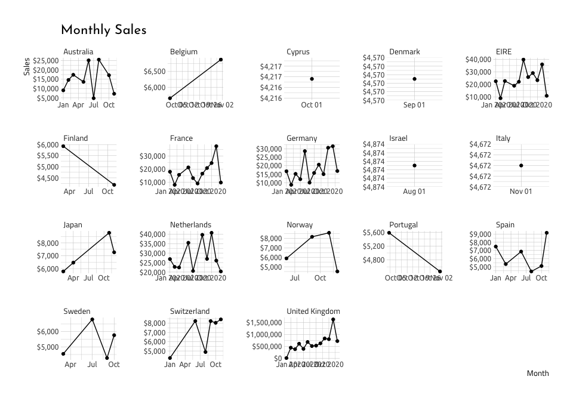

Part 2 - Visualize Cannabis Data
================
Martin Frigaard
current version: 2020-01-27

## Load the packages

These are the packages we will use to visualize the cannabis data.

``` r
library(readr)
library(tidyverse)
library(lubridate)
library(ggthemes)
library(cluster)
library(factoextra)
library(textshape)
```

## Import Online Retail data

This data came from a UK e-commerce dataset from the [UCI Machine
Learning
Laboratory](https://archive.ics.uci.edu/ml/datasets/online+retail).

``` r
# fs::dir_tree("data")
OnlineRetailRaw <- read_csv("data-model/online-retail/Online_Retail.csv") %>% 
    janitor::clean_names(case = "snake")
OnlineRetailRaw %>% glimpse(78)
```

    #>  Observations: 541,909
    #>  Variables: 8
    #>  $ invoice_no   <chr> "536365", "536365", "536365", "536365", "536365", "536…
    #>  $ stock_code   <chr> "85123A", "71053", "84406B", "84029G", "84029E", "2275…
    #>  $ description  <chr> "WHITE HANGING HEART T-LIGHT HOLDER", "WHITE METAL LAN…
    #>  $ quantity     <dbl> 6, 6, 8, 6, 6, 2, 6, 6, 6, 32, 6, 6, 8, 6, 6, 3, 2, 3,…
    #>  $ invoice_date <chr> "12/1/2010 8:26", "12/1/2010 8:26", "12/1/2010 8:26", …
    #>  $ unit_price   <dbl> 2.55, 3.39, 2.75, 3.39, 3.39, 7.65, 4.25, 1.85, 1.85, …
    #>  $ customer_id  <dbl> 17850, 17850, 17850, 17850, 17850, 17850, 17850, 17850…
    #>  $ country      <chr> "United Kingdom", "United Kingdom", "United Kingdom", …

Below we wrangle the invoice date variable into a few additional
variables we can use to get the week over week data.

``` r
OnlineRetail <- OnlineRetailRaw %>% 
    dplyr::mutate(
                invoice_date = as.Date(invoice_date, "%m/%d/%y"),
                dow = day(invoice_date),
                week = week(invoice_date),
                yr = year(invoice_date),
                week_year = floor_date(invoice_date, unit = "week"),
                month = month(week_year, abbr = TRUE, label = TRUE),
                floor_month = floor_date(week_year, unit = "month"))
OnlineRetail %>% glimpse(78)
```

    #>  Observations: 541,909
    #>  Variables: 14
    #>  $ invoice_no   <chr> "536365", "536365", "536365", "536365", "536365", "536…
    #>  $ stock_code   <chr> "85123A", "71053", "84406B", "84029G", "84029E", "2275…
    #>  $ description  <chr> "WHITE HANGING HEART T-LIGHT HOLDER", "WHITE METAL LAN…
    #>  $ quantity     <dbl> 6, 6, 8, 6, 6, 2, 6, 6, 6, 32, 6, 6, 8, 6, 6, 3, 2, 3,…
    #>  $ invoice_date <date> 2020-12-01, 2020-12-01, 2020-12-01, 2020-12-01, 2020-…
    #>  $ unit_price   <dbl> 2.55, 3.39, 2.75, 3.39, 3.39, 7.65, 4.25, 1.85, 1.85, …
    #>  $ customer_id  <dbl> 17850, 17850, 17850, 17850, 17850, 17850, 17850, 17850…
    #>  $ country      <chr> "United Kingdom", "United Kingdom", "United Kingdom", …
    #>  $ dow          <int> 1, 1, 1, 1, 1, 1, 1, 1, 1, 1, 1, 1, 1, 1, 1, 1, 1, 1, …
    #>  $ week         <dbl> 48, 48, 48, 48, 48, 48, 48, 48, 48, 48, 48, 48, 48, 48…
    #>  $ yr           <dbl> 2020, 2020, 2020, 2020, 2020, 2020, 2020, 2020, 2020, …
    #>  $ week_year    <date> 2020-11-29, 2020-11-29, 2020-11-29, 2020-11-29, 2020-…
    #>  $ month        <ord> Nov, Nov, Nov, Nov, Nov, Nov, Nov, Nov, Nov, Nov, Nov,…
    #>  $ floor_month  <date> 2020-11-01, 2020-11-01, 2020-11-01, 2020-11-01, 2020-…

This data set is a little too big, so we’ll get a sample and call it
`WeekOverWeek`.

``` r
WeekOverWeek <- OnlineRetail %>%
    # get the week_year by quantity
  select(week_year, quantity) %>%
    # group these data
  group_by(week_year) %>%
    # summarize the data by weekly quantity
  summarize(week_qty = sum(quantity)) %>%
    # This introduces the lag function, 
    # Compute a lagged version of a time series, shifting the time base 
    # back by a given number of observations.
  mutate(prev_week = lag(week_qty, 1)) %>%
    # now we get the ratio of the difference between the weekly quantity and 
    # the previous week, and we divide that by the previous week.
  mutate(wow_quantity = (week_qty - prev_week) / prev_week) %>%
    # now we calculate the month, using week_year, abbreviations, and labels
  mutate(month = month(week_year, abbr = TRUE, label = TRUE)) %>%
    # and we group this final data set by the week_year variable
  group_by(week_year)
# check this data set
WeekOverWeek %>% dplyr::glimpse(78)
```

    #>  Observations: 52
    #>  Variables: 5
    #>  Groups: week_year [52]
    #>  $ week_year    <date> 2019-12-29, 2020-01-05, 2020-01-12, 2020-01-19, 2020-…
    #>  $ week_qty     <dbl> 7939, 103659, 69528, 72663, 70517, 58585, 67143, 86949…
    #>  $ prev_week    <dbl> NA, 7939, 103659, 69528, 72663, 70517, 58585, 67143, 8…
    #>  $ wow_quantity <dbl> NA, 12.056934123, -0.329262293, 0.045089748, -0.029533…
    #>  $ month        <ord> Dec, Jan, Jan, Jan, Jan, Feb, Feb, Feb, Feb, Mar, Mar,…

## Plot annual sales

These are the annual sales (line plots)

``` r
ggWoWAnnualSales <- WeekOverWeek %>% 
    ggplot2::ggplot(aes(x = week_year, 
                        y = wow_quantity)) +
    ggplot2::geom_line() +
    ggplot2::geom_point() +
    ggplot2::theme(axis.title = element_text()) +   
    ggplot2::theme(legend.title = element_blank()) +
    ggplot2::scale_y_continuous(labels = scales::percent_format(accuracy = 1)) +
    ggplot2::facet_wrap(~ month, scales = "free") + 
    ggplot2::labs(y = 'Sales', 
                  x = 'Week', 
                  title = 'Week Over Week Annual Sales') 
ggWoWAnnualSales 
```

<!-- -->

This shows some missing data in December, and a lot of variance in the
sales from month to month. Now we’re wondering what the quantity sold
per week is, and we can get this with `week_year` and `week_qty`.

``` r
WeekOverWeek %>%
    stats::na.omit() %>%
    ggplot2::ggplot(data = ., 
           aes(x = week_year, 
               y = week_qty)) + 
    ggplot2::geom_line() +
    ggplot2::geom_smooth() +
    ggplot2::geom_point() +
    # stat_summary(fun.y = mean, 
    #              geom = "bar") +
    # stat_summary(fun.data = mean_cl_boot, 
    #              geom = "errorbar", 
    #              width = 0.3) +
    ggplot2::theme(axis.title = element_text()) + 
    ggplot2::theme(legend.position = 'none') +
    ggplot2::labs(
         x = "Week", 
         y = "Quantity Sold",
         title = "Quantity Per Week") -> ggWowQuantity
ggWowQuantity
```

    #>  `geom_smooth()` using method = 'loess' and formula 'y ~ x'

<!-- -->

``` r
OnlineRetailRaw %>% glimpse(78)
```

    #>  Observations: 541,909
    #>  Variables: 8
    #>  $ invoice_no   <chr> "536365", "536365", "536365", "536365", "536365", "536…
    #>  $ stock_code   <chr> "85123A", "71053", "84406B", "84029G", "84029E", "2275…
    #>  $ description  <chr> "WHITE HANGING HEART T-LIGHT HOLDER", "WHITE METAL LAN…
    #>  $ quantity     <dbl> 6, 6, 8, 6, 6, 2, 6, 6, 6, 32, 6, 6, 8, 6, 6, 3, 2, 3,…
    #>  $ invoice_date <chr> "12/1/2010 8:26", "12/1/2010 8:26", "12/1/2010 8:26", …
    #>  $ unit_price   <dbl> 2.55, 3.39, 2.75, 3.39, 3.39, 7.65, 4.25, 1.85, 1.85, …
    #>  $ customer_id  <dbl> 17850, 17850, 17850, 17850, 17850, 17850, 17850, 17850…
    #>  $ country      <chr> "United Kingdom", "United Kingdom", "United Kingdom", …

## Create Monthly Sales data

Next we create the monthly sales data frame, with the `unit_price`,
`quantity`, `country`, and `floor_month`

``` r
MonthlySales <- OnlineRetail %>% 
    # get the floor_month. country, quantity, and unit_price
    dplyr::select(floor_month, 
                  country, 
                  quantity, 
                  unit_price) %>%
    # we can create the "sales"
    dplyr::mutate(sales = quantity*unit_price) %>%
    # now we group by the floor_month and country
    dplyr::group_by(floor_month, country) %>%
    # and summarize this by the monthly_sales adn median sales
    dplyr::summarize(monthly_sales = sum(sales), 
                     median_sales = median(sales)) %>%
    # and group it by the floor_month and country
    group_by(floor_month, country)
# check new data 
MonthlySales %>% dplyr::glimpse(78)
```

    #>  Observations: 300
    #>  Variables: 4
    #>  Groups: floor_month, country [300]
    #>  $ floor_month   <date> 2019-12-01, 2019-12-01, 2020-01-01, 2020-01-01, 2020…
    #>  $ country       <chr> "Sweden", "United Kingdom", "Australia", "Austria", "…
    #>  $ monthly_sales <dbl> 507.56, 14442.92, 9017.71, 364.60, -205.74, 1154.05, …
    #>  $ median_sales  <dbl> 17.000, 7.925, 33.000, 22.650, -205.740, 17.700, 17.3…

``` r
MonthlySales %>% nrow()
```

    #>  [1] 300

``` r
ggTop100MonthlyCountrySales <- MonthlySales %>%
    # sort these by monthly_sales
    dplyr::arrange(desc(monthly_sales)) %>% 
    # get the top 100 sales
    utils::head(100) %>% 
    # plot this as floor_month vs. monthly sales
    ggplot2::ggplot(data = ., 
                    aes(x = floor_month, 
                        y = monthly_sales)) +
    # add a line
    ggplot2::geom_line() +
    # and a point
    ggplot2::geom_point() +
    # and a theme
    ggplot2::theme(axis.title = element_text()) +   
    # with legend title
    ggplot2::theme(legend.title = element_blank()) +
    # and the scales for dollar formats
    ggplot2::scale_y_continuous(labels = scales::dollar_format(accuracy = 1)) +
    ggplot2::facet_wrap(. ~ country, 
                        scales = "free") + 
    ggplot2::labs(y = 'Sales',
                  x = 'Month',
                  title = 'Monthly Sales') 

ggTop100MonthlyCountrySales 
```

    #>  geom_path: Each group consists of only one observation. Do you need to adjust
    #>  the group aesthetic?
    #>  geom_path: Each group consists of only one observation. Do you need to adjust
    #>  the group aesthetic?
    #>  geom_path: Each group consists of only one observation. Do you need to adjust
    #>  the group aesthetic?
    #>  geom_path: Each group consists of only one observation. Do you need to adjust
    #>  the group aesthetic?

<!-- -->

## Median Order Value

This is the median sales by `floor_month`, sorted by the `median_sales`.

``` r
MonthlySales %>%
    # sort these by median_sales
    dplyr::arrange(desc(median_sales)) %>% 
    # get the top 100 sales
    utils::head(50) %>% 
    ggplot2::ggplot(data = ., 
           mapping = aes(x = floor_month, 
                         y = median_sales)) +
    ggplot2::geom_line() +
    # 
    ggplot2::geom_point() +
    # 
    ggplot2::scale_y_continuous(labels = scales::dollar_format(accuracy = 1)) +
    ggplot2::facet_wrap(~ country, 
               scales = "free") + 
    ggplot2::labs(y = 'Sales', 
                  x = 'Month',
                  title = 'Median Order Value') -> ggMedianOrderValue
ggMedianOrderValue
```

<!-- -->

## Create Customer Sales data

These data are the sales by customer id. We create this data frame by
grouping on `customer_id`, then create a `sales` variable by multiplying
the quantity by the unit price (`quantity * unit_price`).

We also create three variables that aggregate the sales (`sum` and
`median`).

``` r
CustomerSales <- OnlineRetail %>%
    # select the customer_id, quantity, and unit_price
    dplyr::select(customer_id, quantity, unit_price) %>%
    # group it by the customer id
    dplyr::group_by(customer_id) %>%
    # create sales (which is the product of quantity and price)
    dplyr::mutate(sales = (quantity * unit_price)) %>%
    # summarize
    dplyr::summarize(
            sales_sum = sum(sales),
            sales_median = median(sales),
            quantity_sum = sum(quantity),
            quantiy_median = median(quantity)) %>%
    # we group this again by customer id
    dplyr::group_by(customer_id)
CustomerSales %>% dplyr::glimpse(78)
```

    #>  Observations: 4,373
    #>  Variables: 5
    #>  Groups: customer_id [4,373]
    #>  $ customer_id    <dbl> 12346, 12347, 12348, 12349, 12350, 12352, 12353, 123…
    #>  $ sales_sum      <dbl> 0.00, 4310.00, 1797.24, 1757.55, 334.40, 1545.41, 89…
    #>  $ sales_median   <dbl> 0.000, 17.000, 41.760, 17.700, 19.800, 17.400, 18.80…
    #>  $ quantity_sum   <dbl> 0, 2458, 2341, 631, 197, 470, 20, 530, 240, 1591, 27…
    #>  $ quantiy_median <dbl> 0, 12, 72, 6, 12, 4, 5, 6, 6, 24, 16, 12, 4, 8, 10, …

## Customer country data

We now join the `CustomerSales` data to a data frame with the distinct
customer ids and countries (`CustomersCountry`).

``` r
CustomersCountry <- OnlineRetail %>%
    dplyr::distinct(customer_id, country) %>%
    dplyr::group_by(customer_id)
# join this to the CustomerSales
CustomersSalesCountry <- CustomerSales %>%
    dplyr::inner_join(CustomersCountry, 
               by = "customer_id")
# check
CustomersSalesCountry %>% dplyr::glimpse(78)
```

    #>  Observations: 4,389
    #>  Variables: 6
    #>  Groups: customer_id [4,373]
    #>  $ customer_id    <dbl> 12346, 12347, 12348, 12349, 12350, 12352, 12353, 123…
    #>  $ sales_sum      <dbl> 0.00, 4310.00, 1797.24, 1757.55, 334.40, 1545.41, 89…
    #>  $ sales_median   <dbl> 0.000, 17.000, 41.760, 17.700, 19.800, 17.400, 18.80…
    #>  $ quantity_sum   <dbl> 0, 2458, 2341, 631, 197, 470, 20, 530, 240, 1591, 27…
    #>  $ quantiy_median <dbl> 0, 12, 72, 6, 12, 4, 5, 6, 6, 24, 16, 12, 4, 8, 10, …
    #>  $ country        <chr> "United Kingdom", "Iceland", "Finland", "Italy", "No…

### Create cluster (modeling) data frame

Ok, now we are going to convert the grouped data frame, drop the missing
rows, and remove any data where sales were less than zero.

``` r
# convert to data frame
CustomerSalesClust <- base::data.frame(CustomerSales)

CustomerSalesClust <- CustomerSalesClust %>%  
    # drop na 
                        tidyr::drop_na() %>%
    # remove sales less than 0
                        dplyr::filter(sales_sum > 0)
skimr::skim(CustomerSalesClust)
```

|                                                  |                    |
| :----------------------------------------------- | :----------------- |
| Name                                             | CustomerSalesClust |
| Number of rows                                   | 4317               |
| Number of columns                                | 5                  |
| \_\_\_\_\_\_\_\_\_\_\_\_\_\_\_\_\_\_\_\_\_\_\_   |                    |
| Column type frequency:                           |                    |
| numeric                                          | 5                  |
| \_\_\_\_\_\_\_\_\_\_\_\_\_\_\_\_\_\_\_\_\_\_\_\_ |                    |
| Group variables                                  | None               |

Data summary

**Variable type: numeric**

| skim\_variable  | n\_missing | complete\_rate |     mean |      sd |      p0 |     p25 |      p50 |      p75 |   p100 | hist  |
| :-------------- | ---------: | -------------: | -------: | ------: | ------: | ------: | -------: | -------: | -----: | :---- |
| customer\_id    |          0 |              1 | 15300.12 | 1720.24 | 12347.0 | 13815.0 | 15299.00 | 16778.00 |  18287 | ▇▇▇▇▇ |
| sales\_sum      |          0 |              1 |  1925.71 | 8267.65 |     2.9 |   302.7 |   658.26 |  1627.13 | 279489 | ▇▁▁▁▁ |
| sales\_median   |          0 |              1 |    26.71 |  112.67 |  \-30.6 |     8.5 |    15.40 |    17.70 |   3861 | ▇▁▁▁▁ |
| quantity\_sum   |          0 |              1 |  1134.13 | 4697.46 |     0.0 |   159.0 |   373.00 |   978.00 | 196719 | ▇▁▁▁▁ |
| quantiy\_median |          0 |              1 |    16.40 |   98.41 |  \-36.0 |     3.0 |     8.00 |    12.00 |   4300 | ▇▁▁▁▁ |

## k-means clustering

Finally, we run a k-means clustering algorithm on the clustered sales
data. *What does a k-means clustering do?* Well, here is a great
definition on
[Medium](https://towardsdatascience.com/understanding-k-means-clustering-in-machine-learning-6a6e67336aa1),

> the objective of K-means is simple: group similar data points together
> and discover underlying patterns. To achieve this objective, K-means
> looks for a fixed number (k) of clusters in a dataset.

The k-means algorithm is an **unsupervised machine learning algorithm.**
The steps to perform this are:

1.  Use the `textshape::column_to_rownames()` function on the clustered
    data frame. This function

> “*Takes an existing column and uses it as rownames instead. This is
> useful when turning a data.frame into a matrix. Inspired by the tibble
> package’s `column_to_row` which is now deprecated if done on a
> `tibble` object. By coercing to a `data.frame` this problem is
> avoided.*”

We’re going to use the non-descript name, `CustomerSalesClust2`. to show
what this function is actually doing. The `utils::str()` function gives
us some information on what kind of object we’ve created here.

``` r
CustomerSalesClust2 <- textshape::column_to_rownames(CustomerSalesClust) 
utils::str(CustomerSalesClust)
```

    #>  'data.frame':   4317 obs. of  5 variables:
    #>   $ customer_id   : num  12347 12348 12349 12350 12352 ...
    #>   $ sales_sum     : num  4310 1797 1758 334 1545 ...
    #>   $ sales_median  : num  17 41.8 17.7 19.8 17.4 ...
    #>   $ quantity_sum  : num  2458 2341 631 197 470 ...
    #>   $ quantiy_median: num  12 72 6 12 4 5 6 6 24 16 ...

``` r
utils::str(CustomerSalesClust2)
```

    #>  'data.frame':   4317 obs. of  4 variables:
    #>   $ sales_sum     : num  4310 1797 1758 334 1545 ...
    #>   $ sales_median  : num  17 41.8 17.7 19.8 17.4 ...
    #>   $ quantity_sum  : num  2458 2341 631 197 470 ...
    #>   $ quantiy_median: num  12 72 6 12 4 5 6 6 24 16 ...

The `CustomerSalesClust2` took the existing data frame
(`CustomerSalesClust`) and removed a column (`customer_id`) and assigned
them a rowname `base::rownames()`.

``` r
base::rownames(CustomerSalesClust2) %>% head()
```

    #>  [1] "12347" "12348" "12349" "12350" "12352" "12353"

2.  The 2nd step is to Scale the new `CustomerSalesClust` with
    `base::scale()`, which now has been transformed via the
    `textshape::column_to_rownames()` function. The `scale()` function
    who’s, “*default method centers and/or scales the columns of a
    numeric matrix.*”

<!-- end list -->

``` r
CustomerSalesClust3 <- base::scale(CustomerSalesClust2)
str(CustomerSalesClust3)
```

    #>   num [1:4317, 1:4] 0.2884 -0.0155 -0.0203 -0.1925 -0.046 ...
    #>   - attr(*, "dimnames")=List of 2
    #>    ..$ : chr [1:4317] "12347" "12348" "12349" "12350" ...
    #>    ..$ : chr [1:4] "sales_sum" "sales_median" "quantity_sum" "quantiy_median"
    #>   - attr(*, "scaled:center")= Named num [1:4] 1925.7 26.7 1134.1 16.4
    #>    ..- attr(*, "names")= chr [1:4] "sales_sum" "sales_median" "quantity_sum" "quantiy_median"
    #>   - attr(*, "scaled:scale")= Named num [1:4] 8267.7 112.7 4697.5 98.4
    #>    ..- attr(*, "names")= chr [1:4] "sales_sum" "sales_median" "quantity_sum" "quantiy_median"

Use the `kmeans()` function with the specifications below:

`centers` = A matrix of cluster centres. `nstart` =

``` r
k2 <- kmeans(CustomerSalesClust, 
             # the number of cluster centries
             centers = 2 , 
             ## random starts do help here with too many clusters
             ## (and are often recommended anyway!):
             nstart = 25)
k2
```

    #>  K-means clustering with 2 clusters of sizes 4310, 7
    #>  
    #>  Cluster means:
    #>    customer_id  sales_sum sales_median quantity_sum quantiy_median
    #>  1    15299.63   1654.774     26.53051     995.7596       16.32889
    #>  2    15598.71 168745.324    136.80571   86332.7143       60.28571
    #>  
    #>  Clustering vector:
    #>     [1] 1 1 1 1 1 1 1 1 1 1 1 1 1 1 1 1 1 1 1 1 1 1 1 1 1 1 1 1 1 1 1 1 1 1 1 1 1
    #>    [38] 1 1 1 1 1 1 1 1 1 1 1 1 1 1 1 1 1 2 1 1 1 1 1 1 1 1 1 1 1 1 1 1 1 1 1 1 1
    #>    [75] 1 1 1 1 1 1 1 1 1 1 1 1 1 1 1 1 1 1 1 1 1 1 1 1 1 1 1 1 1 1 1 1 1 1 1 1 1
    #>   [112] 1 1 1 1 1 1 1 1 1 1 1 1 1 1 1 1 1 1 1 1 1 1 1 1 1 1 1 1 1 1 1 1 1 1 1 1 1
    #>   [149] 1 1 1 1 1 1 1 1 1 1 1 1 1 1 1 1 1 1 1 1 1 1 1 1 1 1 1 1 1 1 1 1 1 1 1 1 1
    #>   [186] 1 1 1 1 1 1 1 1 1 1 1 1 1 1 1 1 1 1 1 1 1 1 1 1 1 1 1 1 1 1 1 1 1 1 1 1 1
    #>   [223] 1 1 1 1 1 1 1 1 1 1 1 1 1 1 1 1 1 1 1 1 1 1 1 1 1 1 1 1 1 1 1 1 1 1 1 1 1
    #>   [260] 1 1 1 1 1 1 1 1 1 1 1 1 1 1 1 1 1 1 1 1 1 1 1 1 1 1 1 1 1 1 1 1 1 1 1 1 1
    #>   [297] 1 1 1 1 1 1 1 1 1 1 1 1 1 1 1 1 1 1 1 1 1 1 1 1 1 1 1 1 1 1 1 1 1 1 1 1 1
    #>   [334] 1 1 1 1 1 1 1 1 1 1 1 1 1 1 1 1 1 1 1 1 1 1 1 1 1 1 1 1 1 1 1 1 1 1 1 1 1
    #>   [371] 1 1 1 1 1 1 1 1 1 1 1 1 1 1 1 1 1 1 1 1 1 1 1 1 1 1 1 1 1 1 1 1 1 1 1 1 1
    #>   [408] 1 1 1 1 1 1 1 1 1 1 1 1 1 1 1 1 1 1 1 1 1 1 1 1 1 1 1 1 1 1 1 1 1 1 1 1 1
    #>   [445] 1 1 1 1 1 1 1 1 1 1 1 1 1 1 1 1 1 1 1 1 1 1 1 1 1 1 1 1 1 1 1 1 1 1 1 1 1
    #>   [482] 1 1 1 1 1 1 1 1 1 1 1 1 1 1 1 1 1 1 1 1 1 1 1 1 1 1 1 1 1 1 1 1 1 1 1 1 1
    #>   [519] 1 1 1 1 1 1 1 1 1 1 1 1 1 1 1 1 1 1 1 1 1 1 1 1 1 1 1 1 1 1 1 1 1 1 1 1 1
    #>   [556] 1 1 1 1 1 1 1 1 1 1 1 1 1 1 1 1 1 1 1 1 1 1 1 1 1 1 1 1 1 1 1 1 1 1 1 1 1
    #>   [593] 1 1 1 1 1 1 1 1 1 1 1 1 1 1 1 1 1 1 1 1 1 1 1 1 1 1 1 1 1 1 1 1 1 1 1 1 1
    #>   [630] 1 1 1 1 1 1 1 1 1 1 1 1 1 1 1 1 1 1 1 1 1 1 1 1 1 1 1 1 1 1 1 1 1 1 1 1 1
    #>   [667] 1 1 1 1 1 1 1 1 1 1 1 1 1 1 1 1 1 1 1 1 1 1 1 1 1 1 1 1 1 1 1 1 1 1 1 1 1
    #>   [704] 1 1 1 1 1 1 1 1 1 1 1 1 1 1 1 1 1 1 1 1 1 1 1 1 1 1 1 1 1 1 1 1 1 1 1 1 1
    #>   [741] 1 1 1 1 1 1 1 1 1 1 1 1 1 1 1 1 1 1 1 1 1 1 1 1 1 1 1 1 1 1 1 1 1 1 1 1 1
    #>   [778] 1 1 1 1 1 1 1 1 1 1 1 1 1 1 1 1 1 1 1 1 1 1 1 1 1 1 1 1 1 1 1 1 1 1 1 1 1
    #>   [815] 1 1 1 1 1 1 1 1 1 1 1 1 1 1 1 1 1 1 1 1 1 1 1 1 1 1 1 1 1 1 1 1 1 1 1 1 1
    #>   [852] 1 1 1 1 1 1 1 1 1 1 1 1 1 1 1 1 1 1 1 1 1 1 1 1 1 1 1 1 1 1 1 1 1 1 1 1 1
    #>   [889] 1 1 1 1 1 1 1 1 1 1 1 1 1 1 1 1 1 1 1 1 1 1 1 1 1 1 1 1 1 1 1 1 1 1 1 1 1
    #>   [926] 1 1 1 1 1 1 1 1 1 1 1 1 1 1 1 1 1 1 1 1 1 1 1 1 1 1 1 1 1 1 1 1 1 1 1 1 1
    #>   [963] 1 1 1 1 1 1 1 1 1 1 1 1 1 1 1 1 1 1 1 1 1 1 1 1 1 1 1 1 1 1 1 1 1 1 1 1 1
    #>  [1000] 1 1 1 1 1 1 1 1 1 1 1 1 1 1 1 1 1 1 1 1 1 1 1 1 1 1 1 1 1 1 1 1 1 1 1 1 1
    #>  [1037] 1 1 1 1 1 1 1 1 1 1 1 1 1 1 1 1 1 1 1 1 1 1 1 1 1 1 1 1 1 1 1 1 1 1 1 1 1
    #>  [1074] 1 1 1 1 1 1 1 1 1 1 1 1 1 1 1 1 1 1 1 1 1 1 1 1 1 1 1 1 1 1 1 1 1 1 1 1 1
    #>  [1111] 1 1 1 1 1 1 1 1 1 1 1 1 1 1 1 1 1 1 1 1 1 1 1 1 1 1 1 1 1 1 1 1 1 1 1 1 1
    #>  [1148] 1 1 1 1 1 1 1 1 1 1 1 1 1 1 1 1 1 1 1 1 1 1 1 1 1 1 1 1 1 1 1 1 1 1 1 1 1
    #>  [1185] 1 1 1 1 1 1 1 1 1 1 1 1 1 1 1 1 1 1 1 1 1 1 1 1 1 1 1 1 1 1 1 1 1 1 1 1 1
    #>  [1222] 1 1 1 1 1 1 1 1 1 1 1 1 1 1 1 1 1 1 1 1 1 1 1 1 1 1 1 1 1 1 1 1 1 1 1 1 1
    #>  [1259] 1 1 1 1 1 1 1 1 1 1 1 1 1 1 1 1 1 1 1 1 1 1 1 1 1 1 1 1 1 1 1 1 1 1 1 1 1
    #>  [1296] 1 1 1 1 1 1 1 1 1 1 1 1 1 1 1 1 1 1 1 1 1 1 1 1 1 1 1 1 1 1 1 2 1 1 1 1 1
    #>  [1333] 1 1 1 1 1 1 1 1 1 1 1 1 1 1 1 1 1 1 1 1 1 1 1 1 1 1 1 1 1 1 1 1 1 1 1 1 1
    #>  [1370] 1 1 1 1 1 1 1 1 1 1 1 1 1 1 1 1 1 1 1 1 1 1 1 1 1 1 1 1 1 1 1 1 1 1 1 1 1
    #>  [1407] 1 1 1 1 1 1 1 1 1 1 1 1 1 1 1 1 1 1 1 1 1 1 1 1 1 1 1 1 1 1 1 1 1 1 1 1 1
    #>  [1444] 1 1 1 1 1 1 1 1 1 1 1 1 1 1 1 1 1 1 1 1 1 1 1 1 1 1 1 1 1 1 1 1 1 1 1 1 1
    #>  [1481] 1 1 1 1 1 1 1 1 1 1 1 1 1 1 1 1 1 1 1 1 1 1 1 1 1 1 1 1 1 1 1 1 1 1 1 1 1
    #>  [1518] 1 1 1 1 1 1 1 1 1 1 1 1 1 1 1 1 1 1 1 1 1 1 1 1 1 1 1 1 1 1 1 1 1 1 1 1 1
    #>  [1555] 1 1 1 1 1 1 1 1 1 1 1 1 1 1 1 1 1 1 1 1 1 1 1 1 1 1 1 1 1 1 1 1 1 1 1 1 1
    #>  [1592] 1 1 1 1 1 1 1 1 1 1 1 1 1 1 1 1 1 1 1 1 1 1 1 1 1 1 1 1 1 1 1 1 1 1 1 1 1
    #>  [1629] 1 1 1 1 1 1 1 1 1 1 1 1 1 1 1 1 1 1 1 1 1 1 1 1 1 1 1 1 1 1 1 1 1 1 1 1 1
    #>  [1666] 1 1 1 1 1 1 1 1 1 1 1 1 1 1 1 2 1 1 1 1 1 1 1 1 1 1 1 1 1 1 1 1 1 1 1 1 1
    #>  [1703] 1 1 1 1 1 1 1 1 1 1 1 1 1 1 1 1 1 1 1 1 1 1 1 1 1 1 1 1 1 1 1 1 1 1 1 1 1
    #>  [1740] 1 1 1 1 1 1 1 1 1 1 1 1 1 1 1 1 1 1 1 1 1 1 1 1 1 1 1 1 1 1 1 1 1 1 1 1 1
    #>  [1777] 1 1 1 1 1 1 1 1 1 1 1 1 1 1 1 1 1 1 1 1 1 1 1 1 1 1 1 1 1 1 1 1 1 1 1 1 1
    #>  [1814] 1 1 1 1 1 1 1 1 1 1 1 1 1 1 1 1 1 1 1 1 1 1 1 1 1 1 1 1 1 1 1 1 1 1 1 1 1
    #>  [1851] 1 1 1 1 1 1 1 1 1 1 1 1 1 1 1 1 1 1 1 2 1 1 1 1 1 1 1 1 1 1 1 1 1 1 1 1 1
    #>  [1888] 1 1 1 1 1 1 1 1 1 1 1 1 1 1 1 1 1 1 1 1 1 1 1 1 1 1 1 1 1 1 1 1 1 1 1 1 1
    #>  [1925] 1 1 1 1 1 1 1 1 1 1 1 1 1 1 1 1 1 1 1 1 1 1 1 1 1 1 1 1 1 1 1 1 1 1 1 1 1
    #>  [1962] 1 1 1 1 1 1 1 1 1 1 1 1 1 1 1 1 1 1 1 1 1 1 1 1 1 1 1 1 1 1 1 1 1 1 1 1 1
    #>  [1999] 1 1 1 1 1 1 1 1 1 1 1 1 1 1 1 1 1 1 1 1 1 1 1 1 1 1 1 1 1 1 1 1 1 1 1 1 1
    #>  [2036] 1 1 1 1 1 1 1 1 1 1 1 1 1 1 1 1 1 1 1 1 1 1 1 1 1 1 1 1 1 1 1 1 1 1 1 1 1
    #>  [2073] 1 1 1 1 1 1 1 1 1 1 1 1 1 1 1 1 1 1 1 1 1 1 1 1 1 1 1 1 1 1 1 1 1 1 1 1 1
    #>  [2110] 1 1 1 1 1 1 1 1 1 1 1 1 1 1 1 1 1 1 1 1 1 1 1 1 1 1 1 1 1 1 1 1 1 1 1 1 1
    #>  [2147] 1 1 1 1 1 1 1 1 1 1 1 1 1 1 1 1 1 1 1 1 1 1 1 1 1 1 1 1 1 1 1 1 1 1 1 1 1
    #>  [2184] 1 1 1 1 1 1 1 1 1 1 1 1 1 1 1 1 1 1 1 1 1 1 1 1 1 1 1 1 1 1 1 1 1 1 1 1 1
    #>  [2221] 1 1 1 1 1 1 1 1 1 1 1 1 1 1 1 1 1 1 1 1 1 1 1 1 1 1 1 1 1 1 1 1 1 1 1 1 1
    #>  [2258] 1 1 1 1 1 1 1 1 1 1 1 1 1 1 1 1 1 1 1 1 1 1 1 1 1 1 1 1 1 1 1 1 1 1 1 1 1
    #>  [2295] 1 1 1 1 1 1 1 1 1 1 1 1 1 1 1 1 1 1 1 1 1 1 1 1 1 1 1 1 1 1 1 1 1 1 1 1 1
    #>  [2332] 1 1 1 1 1 1 1 1 1 1 1 1 1 1 1 1 1 1 1 1 1 1 1 1 1 1 1 1 1 1 1 1 1 1 1 1 1
    #>  [2369] 1 1 1 1 1 1 1 1 1 1 1 1 1 1 1 1 1 1 1 1 1 1 1 1 1 1 1 1 1 1 1 1 1 1 1 1 1
    #>  [2406] 1 1 1 1 1 1 1 1 1 1 1 1 1 1 1 1 1 1 1 1 1 1 1 1 1 1 1 1 1 1 1 1 1 1 1 1 1
    #>  [2443] 1 1 1 1 1 1 1 1 1 1 1 1 1 1 1 1 1 1 1 1 1 1 1 1 1 1 1 1 1 1 1 1 1 1 1 1 1
    #>  [2480] 1 1 1 1 1 1 1 1 1 1 1 1 1 1 1 1 1 1 1 1 1 1 1 1 1 1 1 1 1 1 1 1 1 1 1 1 1
    #>  [2517] 1 1 1 1 1 1 1 1 1 1 1 1 1 1 1 1 1 1 1 1 1 1 1 1 1 1 1 1 1 1 1 1 1 1 1 1 1
    #>  [2554] 1 1 1 1 1 1 1 1 1 1 1 1 1 1 1 1 1 1 1 1 1 1 1 1 1 1 1 1 1 1 1 1 1 1 1 1 1
    #>  [2591] 1 1 1 1 1 1 1 1 1 1 1 1 1 1 1 1 1 1 1 1 1 1 1 1 1 1 1 1 1 1 1 1 1 1 1 1 1
    #>  [2628] 1 1 1 1 1 1 1 1 1 1 1 1 1 1 1 1 1 1 1 1 1 1 1 1 1 1 1 1 1 1 1 1 1 1 1 1 1
    #>  [2665] 1 1 1 1 1 1 1 1 1 1 1 1 1 1 1 1 1 1 1 1 1 1 1 1 1 1 1 1 1 1 1 1 1 1 1 1 1
    #>  [2702] 1 1 1 1 1 1 1 1 1 1 1 1 1 1 1 1 1 1 1 1 1 1 1 1 1 1 1 1 1 1 1 1 1 1 1 1 1
    #>  [2739] 1 1 1 1 1 1 1 1 1 1 1 1 1 1 1 1 1 1 1 1 1 1 1 1 1 1 1 1 1 1 1 1 1 1 1 1 1
    #>  [2776] 1 1 1 1 1 1 1 1 1 1 1 1 1 1 1 1 1 1 1 1 1 1 1 1 1 1 1 1 1 1 1 1 1 1 1 1 1
    #>  [2813] 1 1 1 1 1 1 1 1 1 1 1 1 1 1 1 1 1 1 1 1 1 1 1 1 1 1 1 1 1 1 1 1 1 1 1 1 1
    #>  [2850] 1 1 1 1 1 1 1 1 1 1 1 1 1 1 1 1 1 1 1 1 1 1 1 1 1 1 1 1 1 1 1 1 1 1 1 1 1
    #>  [2887] 1 1 1 1 1 1 1 1 1 1 1 1 1 1 1 1 1 1 1 1 1 1 1 1 1 1 1 1 1 1 1 1 1 1 1 1 1
    #>  [2924] 1 1 1 1 1 1 1 1 1 1 1 1 1 1 1 1 1 1 1 1 1 1 1 1 1 1 1 1 1 1 1 1 1 1 1 1 1
    #>  [2961] 1 1 1 1 1 1 1 1 1 1 1 1 1 1 1 1 1 1 1 1 1 1 1 1 1 1 1 1 1 1 1 1 1 1 1 1 1
    #>  [2998] 1 1 1 1 1 1 1 1 1 1 1 1 1 1 1 1 1 1 1 1 1 1 1 1 1 1 1 1 1 1 1 1 1 1 1 1 1
    #>  [3035] 1 1 1 1 1 1 1 1 1 1 1 1 1 1 1 1 1 1 1 1 1 1 1 1 1 1 1 1 1 1 1 1 1 1 1 1 1
    #>  [3072] 1 1 1 1 1 1 1 1 1 1 1 1 1 1 1 1 1 1 1 1 1 1 1 1 1 1 1 1 1 1 1 1 1 1 1 1 1
    #>  [3109] 1 1 1 1 1 1 1 1 1 1 1 1 1 1 1 1 1 1 1 1 1 1 1 1 1 1 1 1 1 1 1 1 1 1 1 1 1
    #>  [3146] 1 1 1 1 1 1 1 1 1 1 1 1 1 1 1 1 1 1 1 1 1 1 1 1 1 1 1 1 1 1 1 1 1 1 1 1 1
    #>  [3183] 1 1 1 1 1 1 1 1 1 1 1 1 1 1 1 1 1 1 1 1 1 1 1 1 1 1 1 1 1 1 1 1 1 1 1 1 1
    #>  [3220] 1 1 1 1 1 1 1 1 1 1 1 1 1 1 1 1 1 1 1 1 1 1 1 1 1 1 1 1 1 1 1 1 1 1 1 1 1
    #>  [3257] 1 1 1 1 1 1 1 1 1 1 1 1 1 1 1 1 1 1 1 1 1 1 1 1 1 1 1 1 1 1 1 1 1 1 1 1 1
    #>  [3294] 1 1 1 1 1 1 1 1 1 1 1 1 1 1 1 1 1 1 1 1 1 1 1 1 1 1 1 1 1 1 1 1 1 1 1 1 1
    #>  [3331] 1 1 1 1 1 1 1 1 1 1 1 1 1 1 1 1 1 1 1 1 1 1 1 1 1 1 1 1 1 1 1 1 1 1 1 1 1
    #>  [3368] 1 1 1 1 1 1 1 1 1 1 1 1 1 1 1 1 1 1 1 1 1 1 1 1 1 1 1 1 1 1 1 1 1 1 1 1 1
    #>  [3405] 1 1 1 1 1 1 1 1 1 1 1 1 1 1 1 1 1 1 1 1 1 1 1 1 1 1 1 1 1 1 1 1 1 1 1 1 1
    #>  [3442] 1 1 1 1 1 1 1 1 1 1 1 1 1 1 1 1 1 1 1 1 1 1 1 1 1 1 1 1 1 1 1 1 1 1 1 1 1
    #>  [3479] 1 1 1 1 1 1 1 1 1 1 1 1 1 1 1 1 1 1 1 1 1 1 1 1 1 1 1 1 1 1 1 1 1 1 1 1 1
    #>  [3516] 1 1 1 1 1 1 1 1 1 1 1 1 1 1 1 1 1 1 1 1 1 1 1 1 1 1 1 1 1 1 1 1 1 1 1 1 1
    #>  [3553] 1 1 1 1 1 1 1 1 1 1 1 1 1 1 1 1 1 1 1 1 1 1 1 1 1 1 1 1 1 1 1 1 1 1 1 1 1
    #>  [3590] 1 1 1 1 1 1 1 1 1 1 1 1 1 1 1 1 1 1 1 1 1 1 1 1 1 1 1 1 1 1 1 1 1 1 1 1 1
    #>  [3627] 1 1 1 1 1 1 1 1 1 1 1 1 1 1 1 1 1 1 1 1 1 1 1 1 1 1 1 1 1 1 1 1 1 1 1 1 1
    #>  [3664] 1 1 1 1 1 1 1 1 1 1 1 1 1 1 1 1 1 1 1 1 1 1 1 1 1 1 1 1 1 1 1 1 1 1 1 1 1
    #>  [3701] 1 1 1 1 1 1 1 1 1 1 1 1 2 1 1 1 1 1 1 1 1 1 1 1 1 1 1 1 1 1 1 1 1 1 1 1 1
    #>  [3738] 1 1 1 1 1 1 1 1 1 1 1 1 1 1 1 1 1 1 2 1 1 1 1 1 1 1 1 1 1 1 1 1 1 1 1 1 1
    #>  [3775] 1 1 1 1 1 1 1 1 1 1 1 1 1 1 1 1 1 1 1 1 1 1 1 1 1 1 1 1 1 1 1 1 1 1 1 1 1
    #>  [3812] 1 1 1 1 1 1 1 1 1 1 1 1 1 1 1 1 1 1 1 1 1 1 1 1 1 1 1 1 1 1 1 1 1 1 1 1 1
    #>  [3849] 1 1 1 1 1 1 1 1 1 1 1 1 1 1 1 1 1 1 1 1 1 1 1 1 1 1 1 1 1 1 1 1 1 1 1 1 1
    #>  [3886] 1 1 1 1 1 1 1 1 1 1 1 1 1 1 1 1 1 1 1 1 1 1 1 1 1 1 1 1 1 1 1 1 1 1 1 1 1
    #>  [3923] 1 1 1 1 1 1 1 1 1 1 1 1 1 1 1 1 1 1 1 1 1 1 1 1 1 1 1 1 1 1 1 1 1 1 1 1 1
    #>  [3960] 1 1 1 1 1 1 1 1 1 1 1 1 1 1 1 1 1 1 1 1 1 1 1 1 1 1 1 1 1 1 1 1 1 1 1 1 1
    #>  [3997] 1 1 1 1 1 1 1 1 1 1 1 1 1 1 1 1 1 1 1 1 1 1 1 1 1 1 1 1 1 1 1 1 1 1 1 1 1
    #>  [4034] 1 1 1 1 1 1 1 1 1 1 1 1 1 1 1 1 1 1 1 1 1 1 1 1 1 1 1 1 1 1 1 1 1 1 1 1 1
    #>  [4071] 1 1 1 1 1 1 1 1 1 1 1 1 1 1 1 1 1 1 1 1 1 1 1 1 1 1 1 1 1 1 1 1 1 1 1 1 1
    #>  [4108] 1 1 1 1 1 1 1 1 1 1 1 1 1 1 1 1 1 1 1 1 1 1 1 1 1 1 1 1 1 1 1 1 1 1 1 1 1
    #>  [4145] 1 1 1 1 1 1 1 1 1 1 1 1 1 1 1 1 1 1 1 1 1 1 1 1 1 1 1 1 1 1 1 1 1 1 1 1 1
    #>  [4182] 1 2 1 1 1 1 1 1 1 1 1 1 1 1 1 1 1 1 1 1 1 1 1 1 1 1 1 1 1 1 1 1 1 1 1 1 1
    #>  [4219] 1 1 1 1 1 1 1 1 1 1 1 1 1 1 1 1 1 1 1 1 1 1 1 1 1 1 1 1 1 1 1 1 1 1 1 1 1
    #>  [4256] 1 1 1 1 1 1 1 1 1 1 1 1 1 1 1 1 1 1 1 1 1 1 1 1 1 1 1 1 1 1 1 1 1 1 1 1 1
    #>  [4293] 1 1 1 1 1 1 1 1 1 1 1 1 1 1 1 1 1 1 1 1 1 1 1 1 1
    #>  
    #>  Within cluster sum of squares by cluster:
    #>  [1] 109330454524  47779160273
    #>   (between_SS / total_SS =  61.0 %)
    #>  
    #>  Available components:
    #>  
    #>  [1] "cluster"      "centers"      "totss"        "withinss"     "tot.withinss"
    #>  [6] "betweenss"    "size"         "iter"         "ifault"

``` r
fviz_cluster(k2, data = CustomerSalesClust3)
```

<!-- -->

``` r
CustomerSalesCluser <- base::data.frame(CustomerSalesClust, k2$cluster)
CustomerSalesCluser %>% dplyr::glimpse(78)
```

    #>  Observations: 4,317
    #>  Variables: 6
    #>  $ customer_id    <dbl> 12347, 12348, 12349, 12350, 12352, 12353, 12354, 123…
    #>  $ sales_sum      <dbl> 4310.00, 1797.24, 1757.55, 334.40, 1545.41, 89.00, 1…
    #>  $ sales_median   <dbl> 17.000, 41.760, 17.700, 19.800, 17.400, 18.800, 16.9…
    #>  $ quantity_sum   <dbl> 2458, 2341, 631, 197, 470, 20, 530, 240, 1591, 2708,…
    #>  $ quantiy_median <dbl> 12, 72, 6, 12, 4, 5, 6, 6, 24, 16, 12, 4, 8, 10, 6, …
    #>  $ k2.cluster     <int> 1, 1, 1, 1, 1, 1, 1, 1, 1, 1, 1, 1, 1, 1, 1, 1, 1, 1…
