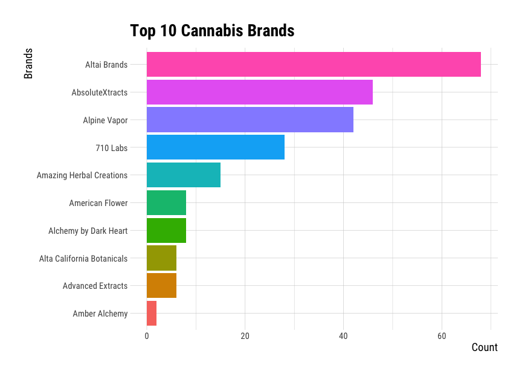
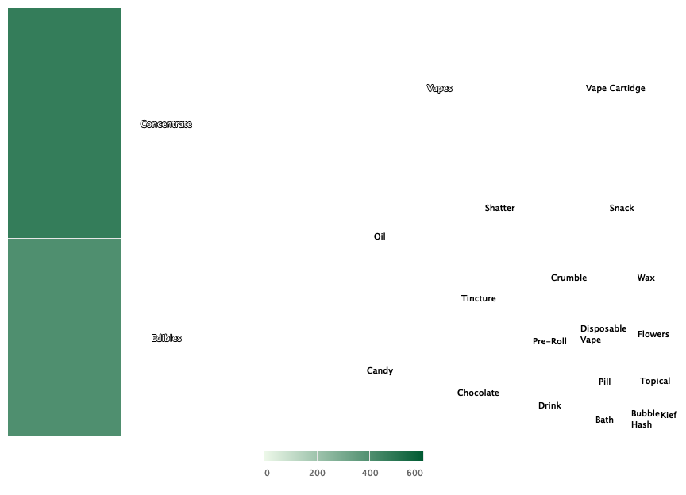
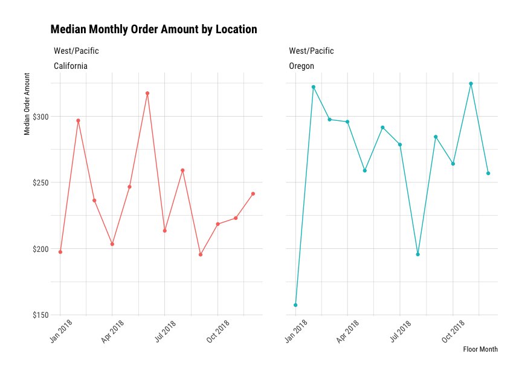

Part 2 - Visualize Cannabis Data
================
Martin Frigaard
current version: 2020-06-27

## Load the packages

These are the packages we will use to visualize the cannabis data.

``` r
library(readr)
library(tidyverse)
library(lubridate)
library(ggthemes)
library(cluster)
library(factoextra)
library(textshape)
library(knitr)
library(rmdformats)
library(plotly)
require(janitor)
require(skimr)
library(mosaic)
library(inspectdf)
library(visdat)
library(DT)
library(hrbrthemes)
```

## Import data

These data came from the [kushy cannabis data
set](https://github.com/kushyapp/cannabis-dataset).

``` r
# fs::dir_tree("data/processed/")
CanData <- readr::read_rds("data/processed/2020-06-27-KushyWowData.rds")
```

``` r
CanData %>% dplyr::glimpse(78)
```

    #>  Rows: 5,130
    #>  Columns: 15
    #>  $ invoice_date     <dttm> 2018-01-01 01:14:43, 2018-01-01 02:53:23, 2018-01…
    #>  $ product_name     <chr> "Sour Diesel", "Sour Diesel", "Sour Diesel", "Sour…
    #>  $ product_rank     <int> 1, 1, 1, 1, 1, 1, 1, 1, 1, 1, 1, 1, 1, 1, 1, 1, 1,…
    #>  $ product_category <chr> "Shatter", "Vapes", "Vape Cartidge", "Concentrate"…
    #>  $ product_details  <chr> "Shatter", "Vaporizer Cartridge", "Vaporizer Cartr…
    #>  $ brand_name       <chr> "Stagecoach", "AbsoluteXtracts", "AbsoluteXtracts"…
    #>  $ location         <chr> "California", "California", "California", "Califor…
    #>  $ product_price    <dbl> 35.51, 84.29, 84.29, 29.83, 29.83, 29.83, 24.35, 2…
    #>  $ units_sold       <dbl> 5, 3, 7, 4, 4, 9, 9, 9, 9, 4, 3, 10, 2, 7, 6, 10, …
    #>  $ dow              <int> 1, 1, 1, 1, 1, 1, 1, 1, 2, 2, 2, 2, 2, 2, 2, 2, 2,…
    #>  $ week             <dbl> 1, 1, 1, 1, 1, 1, 1, 1, 1, 1, 1, 1, 1, 1, 1, 1, 1,…
    #>  $ yr               <dbl> 2018, 2018, 2018, 2018, 2018, 2018, 2018, 2018, 20…
    #>  $ week_year        <dttm> 2017-12-31, 2017-12-31, 2017-12-31, 2017-12-31, 2…
    #>  $ month            <ord> Dec, Dec, Dec, Dec, Dec, Dec, Dec, Dec, Dec, Dec, …
    #>  $ floor_month      <dttm> 2017-12-01, 2017-12-01, 2017-12-01, 2017-12-01, 2…

This `data.frame` is a combination of simulated sales data and some
product and brand data.

### Set the graph theme

I like to use the `hrbrthemes::theme_ipsum_rc()` for themes.

``` r
# set theme
ggplot2::theme_set(hrbrthemes::theme_ipsum_rc(
  base_size = 11,
  strip_text_size = 12,
  axis_title_size = 14,
  plot_title_size = 21,
  subtitle_size = 18
))
```

## Top 10 brand categories

These are the most common brands categories. First we create the data…

``` r
CanData %>% 
  dplyr::count(product_category, sort = TRUE) %>% 
  utils::head(10) %>% 
  dplyr::mutate(product_category = reorder(product_category, n)) -> ProdCatTop10

# export ProdCatTop10 -----
readr::write_rds(x = ProdCatTop10, 
          path = paste0("data/processed/", 
                        base::noquote(lubridate::today()),
                        "-ProdCatTop10.rds"))
# export ProdCatTop10 -----
write_csv(as.data.frame(ProdCatTop10), 
          path = paste0("data/processed/", 
                        base::noquote(lubridate::today()),
                        "-ProdCatTop10.csv"))
```

Now we graph the product categories

``` r
# define labels ----
top_10product_labs <- ggplot2::labs(x = "Product Categories",
                             
                  y = "Count",
                  
                  title = "Top 10 Cannabis Products")

ProdCatTop10 %>% 
  
  ggplot2::ggplot(aes(x = product_category, 
                      y = n)) +
  
    ggplot2::geom_col(aes(fill = product_category), 
                      
                      show.legend = FALSE) +

    ggplot2::coord_flip() +
    
    top_10product_labs -> gg_top10_product_categories

gg_top10_product_categories
```

<!-- -->

Convert this to a plotly object.

``` r
plotly::hide_legend(plotly::toWebGL(
      plotly::ggplotly(p = gg_top10_product_categories)))
```

<!-- -->

This tells me `Concentrate` are the most common brand category. I can
also see `Edibles` and `Vapes` are numbers two and three.

## Top 10 Cannabis Brands

These are the most common product categories, sorted with the most
common first.

``` r
CanData %>% 
  dplyr::count(brand_name) %>%
  utils::head(10) %>% 
  dplyr::mutate(brand_name = reorder(brand_name, n)) -> Top10Brands

# export Top10Brands -----
readr::write_rds(x = Top10Brands, 
          path = paste0("data/processed/", 
                        base::noquote(lubridate::today()),
                        "-Top10Brands.rds"))
# export Top10Brands -----
write_csv(as.data.frame(Top10Brands), 
          path = paste0("data/processed/", 
                        base::noquote(lubridate::today()),
                        "-Top10Brands.csv"))
```

Now we plot this in a column chart.

``` r
# define labels ----
top_10brand_labs <- ggplot2::labs(x = "Brands",
                             
                  y = "Count",
                  
                  title = "Top 10 Cannabis Brands") 

Top10Brands %>%
  ggplot2::ggplot(aes(x = brand_name, 
                      y = n)) +
  
    ggplot2::geom_col(aes(fill = brand_name), 
                      show.legend = FALSE) +
  

    ggplot2::coord_flip() + 
    
    top_10brand_labs -> gg_top10_brands

gg_top10_brands
```

<!-- -->

Convert to plotly

``` r
plotly::hide_legend(plotly::toWebGL(
      plotly::ggplotly(p = gg_top10_brands)))
```

<!-- -->

## Top 25 common brand & brand categories

Now we can group these two variables and count them both, limiting this
to the top 25.

``` r
Top25Data <- CanData %>%
  dplyr::count(brand_name, product_category) %>%
  dplyr::arrange(desc(n)) %>% 
  dplyr::rename(brand_prod_count = n) %>% 
  dplyr::filter(product_category %in% c("Concentrate", "Edibles", 
                                      "Vapes", "Shatter")) %>% 
  utils::head(25) %>% 
  dplyr::mutate(brand = reorder(x = brand_name, 
                                X = brand_prod_count))

# export Top25Data -----
readr::write_rds(x = Top25Data, 
          path = paste0("data/processed/", 
                        base::noquote(lubridate::today()),
                        "-Top25Data.rds"))
# export Top25Data -----
readr::write_csv(as.data.frame(Top25Data), 
          path = paste0("data/processed/", 
                        base::noquote(lubridate::today()),
                        "-Top25Data.csv"))
```

This plot was removed from the dashboard in version 0.0.4

``` r
# define labels ----
top_25_labs <- ggplot2::labs(x = " ",
                             
                  y = "Count",
                  
                  title = "Top 25 Cannabis Brands & Categories") 

# Top25Data col
Top25Data %>%
      
    ggplot2::ggplot(aes(x = brand_name, 
                      
                      y = brand_prod_count, 
                      
                      group = product_category)) +
      
    ggplot2::geom_col(aes(fill = brand_name),
                      width = -.60, 
                      show.legend = FALSE) +
      
    ggplot2::coord_flip() +
      
    ggplot2::facet_wrap(. ~ product_category, 
                        
               scales = "free") + 
      
    ggplot2::theme_minimal(base_size = 10, 
                               
                               base_family = "Ubuntu") +
      
    top_25_labs -> gg_top_25

plotly::hide_legend(plotly::toWebGL(
      plotly::ggplotly(p = gg_top_25)))
```

<!-- -->

## Create Top 75 Categories

This creates a grouped data.frame/tibble on `product_category` and
`units_sold`.

``` r
GroupedCanData <- CanData %>%
  # group this by brand categories and quantity
  dplyr::group_by(product_category, units_sold) %>% 
  # summarize the sales
  dplyr::summarise(units_by_prod_cat = n()) %>% 
  # ungroup this data
  dplyr::ungroup() %>% 
  # get the top 100
  dplyr::sample_n(75)

# export GroupedCanData -----
readr::write_rds(x = GroupedCanData, 
          path = paste0("data/processed/", 
                        base::noquote(lubridate::today()),
                        "-GroupedCanData.rds"))
# export GroupedCanData -----
write_csv(as.data.frame(GroupedCanData), 
          path = paste0("data/processed/", 
                        base::noquote(lubridate::today()),
                        "-GroupedCanData.csv"))
```

## Treemap (`highcharter::hctreemap2`)

This `treemap` is built with the `Top100BrandCatsData`.

``` r
library(highcharter)
library(viridisLite)
library(treemap)
thm <- 
  hc_theme(
    colors = c("#1a6ecc", "#434348", "#90ed7d"),
    chart = list(
      backgroundColor = "transparent",
      style = list(fontFamily = "Ubuntu")
    ),
    xAxis = list(
      gridLineWidth = 1
    )
  )

highcharter::hctreemap2(GroupedCanData, 
              group_vars = c("product_category"),
              size_var = "units_by_prod_cat", 
              color_var = "units_by_prod_cat",
              layoutAlgorithm = "squarified",
              levelIsConstant = FALSE,
              allowDrillToNode = TRUE) %>% 
  
    # add the RColorBrewer greens 
  
    hc_colorAxis(minColor = RColorBrewer::brewer.pal(7, "Greens")[1],
                 
                 maxColor = RColorBrewer::brewer.pal(7, "Greens")[7]) 
```

<!-- -->

## Creating week over week data

The code below creates a `data.frame` that is ‘week-over-week’, which is
not an uncommon way of reporting sales data.

``` r
WeekOverWeek <- CanData %>%
    # get the week_year by units_sold
  select(week_year, units_sold) %>%
    # group these data
  group_by(week_year) %>%
    # summarize the data by weekly units_sold
  summarize(week_qty = sum(units_sold)) %>%
    # This introduces the lag function, 
    # Compute a lagged version of a time series, shifting the time base 
    # back by a given number of observations.
  mutate(prev_week = lag(week_qty, 1)) %>%
    # now we get the ratio of the difference between the weekly quantity and 
    # the previous week, and we divide that by the previous week.
  mutate(wow_quantity = (week_qty - prev_week) / prev_week) %>%
    # now we calculate the month, using week_year, abbreviations, and labels
  mutate(month = month(week_year, abbr = TRUE, label = TRUE)) %>%
    # and we group this final data set by the week_year variable
  group_by(week_year) %>%
  # ungroup
  ungroup()

WeekOverWeek <- WeekOverWeek %>% 
  dplyr::mutate(invoice_year = if_else(condition = week_year >= lubridate::as_date("2019-01-01"), 
                                       true = 2019,
                                       false = 2018))
WeekOverWeek %>% count(invoice_year)
```

    #>  # A tibble: 2 x 2
    #>    invoice_year     n
    #>           <dbl> <int>
    #>  1         2018    53
    #>  2         2019    52

Here we see there is a data.frame with 54 rows (one for each week). And
this data set is still grouped, but that won’t be an issue.

## Plot annual sales (by week)

First we will reset the graph theme to a little smaller font to allow
the dates to show up on the x-axis.

``` r
# set theme
ggplot2::theme_set(hrbrthemes::theme_ipsum_rc(
  base_size = 10,
  strip_text_size = 11,
  axis_title_size = 9,
  plot_title_size = 15,
  subtitle_size = 13
))
```

## Create quarter drop-down

We will create a quarter drop-down variable for the dashboard. The data
we created above allows us to plot the week over week sales by their
brand categories.

We will plot these data by quarters:

  - Q1 = Oct, Nov, and Dec  
  - Q2 = Jan, Feb, and Mar  
  - Q3 is Apr, May, and Jun  
  - Q4 is Jul, Aug, and Sep

<!-- end list -->

``` r
WeekOverWeek <- WeekOverWeek %>% 
  dplyr::mutate(quar = lubridate::quarter(x = week_year),
                quar_fct = factor(quar, 
                      levels = c(1, 2, 3, 4),
                      labels = c("Q1", "Q2", "Q3", "Q4"),
                      ordered = TRUE))
# check
WeekOverWeek %>% 
  group_by(quar_fct) %>% 
  count(quar) %>% 
  spread(quar_fct, n)
```

    #>  # A tibble: 4 x 5
    #>     quar    Q1    Q2    Q3    Q4
    #>    <int> <int> <int> <int> <int>
    #>  1     1    25    NA    NA    NA
    #>  2     2    NA    26    NA    NA
    #>  3     3    NA    NA    27    NA
    #>  4     4    NA    NA    NA    27

Export the week over week.

``` r
# export WeekOverWeek -----
readr::write_rds(x = WeekOverWeek, 
          path = paste0("data/processed/", 
                        base::noquote(lubridate::today()),
                        "-WeekOverWeek.rds"))
# export WeekOverWeek -----
write_csv(as.data.frame(WeekOverWeek), 
          path = paste0("data/processed/", 
                        base::noquote(lubridate::today()),
                        "-WeekOverWeek.csv"))
```

## Week over week annual Sales

These are the week over week annual sales (quantity), faceted by
`month`, which needs at least one level.

``` r
  # these are the labels
labs_wow_annual_sales <- ggplot2::labs(
  y = 'Sales', 
  x = 'Week', 
  title = 'Week Over Week Annual Sales',
  subtitle = "Simulated Cannabis Sales Data",
  caption = "Graphic and analysis by PDG") 

WoWAnnualSales <- WeekOverWeek %>% 
  # limit range of dates
  filter(invoice_year == 2018) %>% 
            # filter this by the quarter (which will be in dropdown)
            dplyr::filter(quar == 4) %>% 
  # remove missing 
  tidyr::drop_na()

WoWAnnualSales %>% 
  
  # this will put week_year on the x
    ggplot2::ggplot(aes(x = week_year, 
                        # and the week over week quantity on the y
                        y = wow_quantity)) +
                        # group by month
  # add the line plot
    ggplot2::geom_line(aes(color = month), 
                       show.legend = FALSE) +
  # and the point
    ggplot2::geom_point(aes(color = month), 
                        show.legend = FALSE) +
  # the axis title here will inherit the size and color
    ggplot2::theme(axis.title = element_text(face = c("bold"))) +
  # this will remove the legend
    ggplot2::theme(legend.title = element_blank()) +
  # this adds the percent on the y axis
    ggplot2::scale_y_continuous(labels = scales::percent_format(accuracy = 1),) +
  # here we facet by the month
    ggplot2::facet_wrap(. ~ month, 
                        scales = "free") + 
    ggplot2::theme(axis.text.x = 
                     element_text(angle = 45, 
                                  hjust = 0.5, 
                                  vjust = 0.5)) +
  
  labs_wow_annual_sales -> gg_wow_sales
```

``` r
# Convert this to a `plotly` object.
plotly::hide_legend(
plotly::toWebGL(plotly::ggplotly(p = gg_wow_sales,
                                 tooltip = c("x", "y"))))
```

<!-- -->

## Quantity sold per week

Now we’re wondering what the quantity sold per week is, and we can get
this with `week_year` and `week_qty`.

``` r
WeekOverWeek <- WeekOverWeek %>% 
  # make sure this is all positive!
  dplyr::mutate(week_qty = abs(week_qty)) %>%
  # remove missing
  tidyr::drop_na()
```

``` r
labs_quantity_per_week <- ggplot2::labs(
         x = "Week", 
         y = "Quantity Sold",
         title = "Quantity Per Week") 

QuantityPerWeek <- WeekOverWeek %>%
  # drop missing
    tidyr::drop_na() %>%
  # filter year
    dplyr::filter(invoice_year == 2018)

QuantityPerWeek %>% 
  # plot week_year on the x
    ggplot2::ggplot(data = ., 
           aes(x = week_year, 
               # and week quantity on the y
               y = week_qty)) + 
  # add the line plot
    ggplot2::geom_line() +
  # add the smooth (predictor)
    ggplot2::geom_smooth() +
  # add points
    ggplot2::geom_point() +
  # add labs
    labs_quantity_per_week -> ggWowQuantity

# convert to plotly
plotly::toWebGL(plotly::ggplotly(ggWowQuantity))
```

<!-- -->

These were used in the previous graph:

``` r
    stat_summary(fun.y = mean,
                 geom = "bar") +
    stat_summary(fun.data = mean_cl_boot,
                 geom = "errorbar",
                 width = 0.3) +
```

But I opted for the line + points.

## Create Monthly Sales by Location

Next we create the monthly sales data frame, with the `unit_price`,
`quantity`, `location`, and `floor_month`.

``` r
MonthlyLocationSales <- CanData %>% 
    # get the floor_month. location, quantity, and unit_price
    dplyr::select(floor_month, 
                  location, 
                  units_sold,  
                  product_price) %>%
    dplyr::filter(floor_month >= lubridate::as_date("2018-01-01")) %>% 
    # we can create the new location variable
    dplyr::mutate(
            sales_per_loc = units_sold*product_price, 
            location = case_when(
              # # Colorado
              location %in% "Salisbury Postcode Area (UK)" ~ "Colorado",
              location %in% "Nova Scotia" ~ "Colorado",   
              location %in% "British Columbia" ~ "Colorado",
              location %in% "Alberta" ~ "Colorado",
              # Oregon
              location %in% "Ontario" ~ "Oregon",        
              location %in% "Michigan" ~ "Oregon",
              # Washington
              location %in% "Newfoundland" ~ "Washington",
              location %in% "Manitoba" ~ "Washington",        
              location %in% "Saskatchewan" ~ "Washington",
              # else is location
              TRUE ~ location)) %>% 
    # now we group by the floor_month and location
    dplyr::group_by(floor_month, location) %>%
    # and summarize this by the monthly_sales and median sales
    dplyr::summarize(tot_mnth_sale_loc = sum(sales_per_loc, na.rm = TRUE), 
                     med_mnth_sale_loc = median(sales_per_loc, na.rm = TRUE)) %>%
    # and group it by the floor_month and location
    dplyr::mutate(sales_region = case_when(
                  location == "Colorado" ~ "West/Mountain",
                  location == "Nevada" ~ "West/Mountain",
  
                  location == "California" ~ "West/Pacific",
                  location == "Oregon" ~ "West/Pacific",
                  location == "Washington" ~ "West/Pacific"),
              
                sales_reg_num = case_when(
                sales_region %in% "West/Pacific" ~ 1,
                sales_region %in% "West/Mountain" ~ 2)) %>% 
  
    dplyr::group_by(floor_month, location)
# check new data 
MonthlyLocationSales <- MonthlyLocationSales %>% 
  dplyr::mutate(invoice_year = if_else(condition = floor_month >= lubridate::as_date("2019-01-01"), 
                                       true = 2019,
                                       false = 2018,
                                       missing = NA_real_))
MonthlyLocationSales %>% count(invoice_year)
```

    #>  # A tibble: 85 x 4
    #>  # Groups:   floor_month, location [85]
    #>     floor_month         location   invoice_year     n
    #>     <dttm>              <chr>             <dbl> <int>
    #>   1 2018-01-01 00:00:00 California         2018     1
    #>   2 2018-01-01 00:00:00 Colorado           2018     1
    #>   3 2018-01-01 00:00:00 Nevada             2018     1
    #>   4 2018-01-01 00:00:00 Oregon             2018     1
    #>   5 2018-02-01 00:00:00 California         2018     1
    #>   6 2018-02-01 00:00:00 Colorado           2018     1
    #>   7 2018-02-01 00:00:00 Oregon             2018     1
    #>   8 2018-03-01 00:00:00 California         2018     1
    #>   9 2018-03-01 00:00:00 Nevada             2018     1
    #>  10 2018-03-01 00:00:00 Oregon             2018     1
    #>  # … with 75 more rows

This gives us a grouped `data.frame` with 138 rows.

## Total Monthly Sales by Region/Location

This plot will graph the monthly sales of cannabis products by their
location (abbreviated).

``` r
# labels
labs_monthly_location_sales <- ggplot2::labs(y = 'Total Monthly Sales',
                  x = ' ',
                  title = 'Total Monthly Sales By Region & Location')

# plot
MonthlyLocationSales %>%
    # sort these by total_monthly_sales
    dplyr::arrange(desc(tot_mnth_sale_loc)) %>% 
    # plot this as floor_month vs. monthly sales
    dplyr::filter(sales_reg_num == 2, 
                  invoice_year == 2018) %>% 
    # plot
    ggplot2::ggplot(data = ., 
                    # month
                    aes(x = floor_month, 
                        # total monthly sales here
                        y = tot_mnth_sale_loc)) +
    # add a line
    ggplot2::geom_line(aes(color = location), show.legend = FALSE) +
    # and a point
    ggplot2::geom_point(aes(color = location), show.legend = FALSE) +
    # and a theme
    ggplot2::theme(axis.title = 
                     element_text()) +   
    # with legend title
    ggplot2::theme(legend.title = 
                     element_blank()) +
    # and the scales for dollar formats
    ggplot2::scale_y_continuous(labels = 
                                  scales::dollar_format(accuracy = 1)) +
    # facet by the sales_region
    ggplot2::facet_wrap(location ~ sales_region, 
                        scales = "free_x") + 
    # adjust the x axis text
    ggplot2::theme(axis.text.x = 
                     element_text(angle = 45, 
                                  hjust = 0.5, 
                                  vjust = 0.5)) +
    # add labs
    labs_monthly_location_sales -> ggTop100MonthlyLocationSales
```

``` r
# convert to plotly
plotly::hide_legend(
  plotly::toWebGL(
    plotly::ggplotly(ggTop100MonthlyLocationSales)))
```

<!-- -->

Faceting by region and coloring by region while having months on the x
axis is helpful for spotting trends. Graphs like this can help us spot
gaps in total sales by location (i.e. California vs. Manitoba).

## Median Order Amount By Location

This is the median sales by `floor_month`, sorted by the `median_sales`.

``` r
# labels
labs_median_order_value <- ggplot2::labs(
                  y = 'Median Order Amount', 
                  x = 'Floor Month',
                  title = 'Median Monthly Order Amount by Location')
# plot
ggMedianOrderValue <- MonthlyLocationSales %>%
    # sort these by median_sales
    dplyr::arrange(desc(med_mnth_sale_loc)) %>% 

    # plot this as sales_reg_num is Western/Mountain and 2018
    dplyr::filter(sales_reg_num == 1 & invoice_year == 2018) %>% 
    # plot
    ggplot2::ggplot(data = ., 
                    # put months on the x 
           mapping = aes(x = floor_month, 
                         # median monthly sales
                         y = med_mnth_sale_loc)) +
    # add the line
    ggplot2::geom_line(aes(color = location), show.legend = FALSE) +
    # add the point
    ggplot2::geom_point(aes(color = location), show.legend = FALSE) +
    # add the y format
    ggplot2::scale_y_continuous(labels = 
                                    scales::dollar_format(accuracy = 1)) +
  
    # facet this by the location and set scales to free
    ggplot2::facet_wrap(sales_region ~ location, 
                        scales = "free_x") + 
  
      # adjust the x axis text
    ggplot2::theme(axis.text.x = 
                     element_text(angle = 45, 
                                  hjust = 0.5, 
                                  vjust = 0.5)) +
  # add the labels
  labs_median_order_value

ggMedianOrderValue
```

<!-- -->

## Export

Time-stamp and export.

``` r
# export MonthlyLocationSales -----
readr::write_rds(x = MonthlyLocationSales, 
          path = paste0("data/processed/", 
                        base::noquote(lubridate::today()),
                        "-MonthlyLocationSales.rds"))
# export MonthlyLocationSales -----
readr::write_csv(as.data.frame(MonthlyLocationSales), 
          path = paste0("data/processed/", 
                        base::noquote(lubridate::today()),
                        "-MonthlyLocationSales.csv"))

fs::dir_ls("data/processed/", 
           regexp = "-MonthlyLocationSales")
```

    #>  data/processed/2020-06-27-MonthlyLocationSales.csv
    #>  data/processed/2020-06-27-MonthlyLocationSales.rds

``` r
fs::dir_tree("data/processed/", 
             recurse = TRUE)
```

    #>  data/processed/
    #>  ├── 2020-06-27-GroupedCanData.csv
    #>  ├── 2020-06-27-GroupedCanData.rds
    #>  ├── 2020-06-27-KushyWowData.csv
    #>  ├── 2020-06-27-KushyWowData.rds
    #>  ├── 2020-06-27-MonthlyLocationSales.csv
    #>  ├── 2020-06-27-MonthlyLocationSales.rds
    #>  ├── 2020-06-27-ProdCatTop10.csv
    #>  ├── 2020-06-27-ProdCatTop10.rds
    #>  ├── 2020-06-27-Top10Brands.csv
    #>  ├── 2020-06-27-Top10Brands.rds
    #>  ├── 2020-06-27-Top25Data.csv
    #>  ├── 2020-06-27-Top25Data.rds
    #>  ├── 2020-06-27-Top75ProdCatsData.csv
    #>  ├── 2020-06-27-Top75ProdCatsData.rds
    #>  ├── 2020-06-27-WeekOverWeek.csv
    #>  └── 2020-06-27-WeekOverWeek.rds
