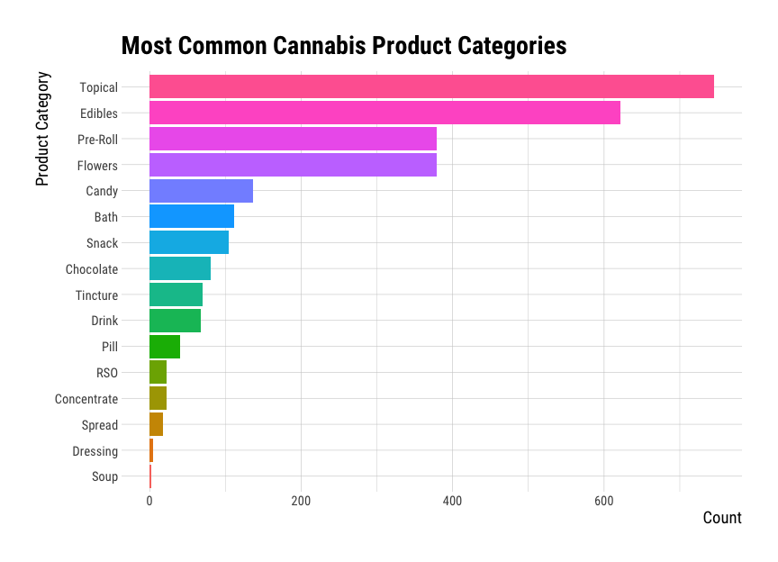

Part 2 - Visualize Cannabis Data
================
Martin Frigaard
current version: 2020-03-19

## Load the packages

These are the packages we will use to visualize the cannabis data.

``` r
library(readr)
library(tidyverse)
library(lubridate)
library(ggthemes)
library(cluster)
library(factoextra)
library(textshape)
library(knitr)
library(rmdformats)
library(plotly)
require(janitor)
require(skimr)
library(mosaic)
library(inspectdf)
library(visdat)
library(DT)
library(hrbrthemes)
```

## Import data

This data came from a UK e-commerce dataset from the [UCI Machine
Learning
Laboratory](https://archive.ics.uci.edu/ml/datasets/online+retail) and
the [kushy cannabis data
set](https://github.com/kushyapp/cannabis-dataset).

``` r
# fs::dir_tree("data/processed/")
CannabisWowData <- read_csv("data/processed/2020-03-17-CannabisWowData.csv")
```

``` r
CannabisWowData %>% dplyr::glimpse() 
```

    #>  Observations: 2,799
    #>  Variables: 21
    #>  $ id               <dbl> 404, 404, 404, 404, 404, 404, 216, 216, 216, 216, …
    #>  $ location         <chr> "California", "California", "California", "Califor…
    #>  $ quantity         <dbl> 1296, 600, 600, 480, 360, 240, 240, 200, 192, 150,…
    #>  $ unit_price       <dbl> 1.06, 0.42, 1.79, 0.36, 0.42, 2.55, 0.39, 1.74, 0.…
    #>  $ cost_per_invoice <dbl> 1373.76, 252.00, 1074.00, 172.80, 151.20, 612.00, …
    #>  $ product_name     <chr> "Sour Diesel", "Sour Diesel", "Sour Diesel", "Sour…
    #>  $ prod_name_count  <dbl> 480, 480, 480, 480, 480, 480, 423, 423, 423, 423, …
    #>  $ product_category <chr> "Flowers", "Flowers", "Flowers", "Pre-Roll", "Pre-…
    #>  $ invoice_date     <date> 2020-10-07, 2020-07-24, 2020-10-06, 2020-04-18, 2…
    #>  $ dow              <dbl> 7, 24, 6, 18, 18, 6, 28, 11, 8, 21, 12, 21, 23, 3,…
    #>  $ week             <dbl> 41, 30, 40, 16, 12, 49, 44, 41, 15, 47, 28, 47, 21…
    #>  $ yr               <dbl> 2020, 2020, 2020, 2020, 2020, 2020, 2020, 2020, 20…
    #>  $ week_year        <date> 2020-10-04, 2020-07-19, 2020-10-04, 2020-04-12, 2…
    #>  $ month            <chr> "Oct", "Jul", "Oct", "Apr", "Mar", "Dec", "Oct", "…
    #>  $ floor_month      <date> 2020-10-01, 2020-07-01, 2020-10-01, 2020-04-01, 2…
    #>  $ invoice_no       <dbl> 570097, 561051, 569815, 550344, 546992, 580985, 57…
    #>  $ stock_code       <chr> "20971", "21977", "85099F", "22546", "21977", "226…
    #>  $ product_details  <chr> "Pre-roll", "Pre-roll", "Pre-roll", "Pre-roll", "P…
    #>  $ brand            <chr> "Medi Cone", "Medi Cone", "Medi Cone", "Medi Cone"…
    #>  $ brand_name       <chr> "Day Dreamers", "Day Dreamers", "Day Dreamers", "D…
    #>  $ brand_category   <chr> "Concentrates", "Edibles", "Medical", "Concentrate…

This `data.frame` is a combination of some sales data with some product
and brand data.

### Set the graph theme

I like to use the `hrbrthemes::theme_ipsum_rc()`

``` r
# set theme
ggplot2::theme_set(hrbrthemes::theme_ipsum_rc(
  base_size = 11,
  strip_text_size = 12,
  axis_title_size = 14,
  plot_title_size = 21,
  subtitle_size = 18
))
```

## Most common brand categories

These are the most common brands categories.

``` r
CannabisWowData %>% 
  dplyr::count(brand_category, sort = TRUE) %>% 
  dplyr::mutate(brand_category = reorder(brand_category, n)) %>%
  ggplot2::ggplot(aes(x = brand_category, y = n)) +
    ggplot2::geom_col(aes(fill = brand_category), 
                      show.legend = FALSE) +
    ggplot2::labs(x = "Brand Category",
                  y = "Count",
                  title = "Most Common Cannabis Brand Categories") +
    ggplot2::coord_flip()
```

<!-- -->

This tells me there are 17 different categories for brands, and
`Concentrates` are the most common brand category. I can also see
`Flower` and `Edibles` are numbers two and three.

## Most common product categories

These are the most common product categories, sorted with the most
common first.

``` r
CannabisWowData %>% 
  dplyr::count(product_category, sort = TRUE) %>% 
  dplyr::mutate(product_category = reorder(product_category, n)) %>%
  ggplot2::ggplot(aes(x = product_category, y = n)) +
    ggplot2::geom_col(aes(fill = product_category), 
                      show.legend = FALSE) +
    ggplot2::labs(x = "Product Category",
                  y = "Count",
                  title = "Most Common Cannabis Product Categories") +
    ggplot2::coord_flip()
```

<!-- -->

## Creating week over week data

The code below creates a data.frame that is ‘week-over-week’, which is
not an uncommon way of reporting sales data.

``` r
WeekOverWeek <- CannabisWowData %>%
    # get the week_year by quantity
  select(week_year, quantity) %>%
    # group these data
  group_by(week_year) %>%
    # summarize the data by weekly quantity
  summarize(week_qty = sum(quantity)) %>%
    # This introduces the lag function, 
    # Compute a lagged version of a time series, shifting the time base 
    # back by a given number of observations.
  mutate(prev_week = lag(week_qty, 1)) %>%
    # now we get the ratio of the difference between the weekly quantity and 
    # the previous week, and we divide that by the previous week.
  mutate(wow_quantity = (week_qty - prev_week) / prev_week) %>%
    # now we calculate the month, using week_year, abbreviations, and labels
  mutate(month = month(week_year, abbr = TRUE, label = TRUE)) %>%
    # and we group this final data set by the week_year variable
  group_by(week_year)
# check this data set
WeekOverWeek %>% utils::str()
```

    #>  Classes 'grouped_df', 'tbl_df', 'tbl' and 'data.frame': 52 obs. of  5 variables:
    #>  $ week_year : Date, format: "2019-12-29" "2020-01-05" ...
    #>  $ week_qty : num 47 432 366 400 260 320 402 318 ...
    #>  $ prev_week : num NA 47 432 366 400 260 320 402 ...
    #>  $ wow_quantity: num NA 8.1915 -0.1528 0.0929 ...
    #>  $ month : Ord.factor w/ 12 levels "Jan"<"Feb"<"Mar"<..: 12 1 1 1 1 2 2 2 ...
    #>  - attr(*, "groups")=Classes 'tbl_df', 'tbl' and 'data.frame': 52 obs. of 2
    #>     variables:
    #>  ..$ week_year: Date, format: "2019-12-29" "2020-01-05" ...
    #>  ..$ .rows :List of 52
    #>  .. ..$ : int 1
    #>  .. ..$ : int 2
    #>  .. ..$ : int 3
    #>  .. ..$ : int 4
    #>  .. ..$ : int 5
    #>  .. ..$ : int 6
    #>  .. ..$ : int 7
    #>  .. ..$ : int 8
    #>  .. ..$ : int 9
    #>  .. ..$ : int 10
    #>  .. ..$ : int 11
    #>  .. ..$ : int 12
    #>  .. ..$ : int 13
    #>  .. ..$ : int 14
    #>  .. ..$ : int 15
    #>  .. ..$ : int 16
    #>  .. ..$ : int 17
    #>  .. ..$ : int 18
    #>  .. ..$ : int 19
    #>  .. ..$ : int 20
    #>  .. ..$ : int 21
    #>  .. ..$ : int 22
    #>  .. ..$ : int 23
    #>  .. ..$ : int 24
    #>  .. ..$ : int 25
    #>  .. ..$ : int 26
    #>  .. ..$ : int 27
    #>  .. ..$ : int 28
    #>  .. ..$ : int 29
    #>  .. ..$ : int 30
    #>  .. ..$ : int 31
    #>  .. ..$ : int 32
    #>  .. ..$ : int 33
    #>  .. ..$ : int 34
    #>  .. ..$ : int 35
    #>  .. ..$ : int 36
    #>  .. ..$ : int 37
    #>  .. ..$ : int 38
    #>  .. ..$ : int 39
    #>  .. ..$ : int 40
    #>  .. ..$ : int 41
    #>  .. ..$ : int 42
    #>  .. ..$ : int 43
    #>  .. ..$ : int 44
    #>  .. ..$ : int 45
    #>  .. ..$ : int 46
    #>  .. ..$ : int 47
    #>  .. ..$ : int 48
    #>  .. ..$ : int 49
    #>  .. ..$ : int 50
    #>  .. ..$ : int 51
    #>  .. ..$ : int 52
    #>  ..- attr(*, ".drop")= logi TRUE

Here we see there is a data.frame with 52 rows (one for each week).

## Plot annual sales (by week)

These are the annual sales (line plots) by week, faceted by month.

``` r
# set theme
ggplot2::theme_set(hrbrthemes::theme_ipsum_rc(
  base_size = 10,
  strip_text_size = 11,
  axis_title_size = 9,
  plot_title_size = 15,
  subtitle_size = 13
))
```

## Week over week annual Sales

These are the week over week annual sales.

``` r
  # these are the labels
labs_wow_annual_sales <- ggplot2::labs(
  y = 'Sales', 
  x = 'Week', 
  title = 'Week Over Week Annual Sales',
  subtitle = "Simulated Cannabis Sales Data",
  caption = "graphic and analysis by PDG") 

ggWoWAnnualSales <- WeekOverWeek %>% 
  # this will put week_year on the x
    ggplot2::ggplot(aes(x = week_year, 
                        # and the week over week quantity on the y
                        y = wow_quantity)) +
  # add the line plot
    ggplot2::geom_line() +
  # and the point
    ggplot2::geom_point() +
  # the axis title here will inherit the size and color
    ggplot2::theme(axis.title = element_text(face = c("bold"))) +
  # this will remove the legend
    ggplot2::theme(legend.title = element_blank()) +
  # this adds the percent on the y axis
    ggplot2::scale_y_continuous(labels = scales::percent_format(accuracy = 1),) +
  # here we facet by the month
    ggplot2::facet_wrap(. ~ month, 
                        # 
                        scales = "free") + 
    ggplot2::theme(axis.text.x = 
                     element_text(angle = 45, 
                                  hjust = 0.5, 
                                  vjust = 0.5)) +
  labs_wow_annual_sales
ggWoWAnnualSales 
```

<!-- -->

This shows some missing data in December, and a lot of variance in the
sales from month to month. We can check the missing data for December
using the data summary below.

``` r
knitr::kable(
WeekOverWeek %>% 
  dplyr::filter(month == "Dec") %>% 
  dplyr::select(week_year, 
                wow_quantity))
```

| week\_year    |                                                                             wow\_quantity |
| :------------ | ----------------------------------------------------------------------------------------: |
| 2019-12-29    |                                                                                        NA |
| 2020-12-06    |                                                                                 1.2083863 |
| 2020-12-13    |                                                                               \-0.6846951 |
| 2020-12-20    |                                                                               \-0.8467153 |
| We can see th | e data are missing for December of 2019. We’ll remove this and plot the non-missing data. |

``` r
# labels
labs_missing_dec <- ggplot2::labs(
  title = "Week over week sales (December)",
     y = "Week over week quantity",
     x = "Week year")
# plot only December
WeekOverWeek %>% 
  dplyr::filter(month == "Dec" & 
                  !is.na(wow_quantity)) %>% 
    # this will put week_year on the x
    ggplot2::ggplot(aes(x = week_year, 
                        # and the week over week quantity on the y
                        y = wow_quantity)) +
  # add the line plot
    ggplot2::geom_line() +
  # and the point
    ggplot2::geom_point() +
  # the axis title here will inherit the size and color
    ggplot2::theme(axis.title = element_text(face = c("bold"))) +
  # this will remove the legend
    ggplot2::theme(legend.title = element_blank()) +
  # this adds the percent on the y axis
    ggplot2::scale_y_continuous(labels = 
                                  scales::percent_format(accuracy = 1)) + 
  labs_missing_dec
```

<!-- -->

## Quantity sold per week

Now we’re wondering what the quantity sold per week is, and we can get
this with `week_year` and `week_qty`.

``` r
labs_quantity_per_week <- ggplot2::labs(
         x = "Week", 
         y = "Quantity Sold",
         title = "Quantity Per Week") 

ggWowQuantity <- WeekOverWeek %>%
  # drop missing
    tidyr::drop_na() %>%
  # plot week_year on the x
    ggplot2::ggplot(data = ., 
           aes(x = week_year, 
               # and week quantity on the y
               y = week_qty)) + 
  # add the line plot
    ggplot2::geom_line() +
  # add the smooth (predictor)
    ggplot2::geom_smooth() +
  # add points
    ggplot2::geom_point() +
    labs_quantity_per_week
ggWowQuantity
```

<!-- -->

These were used in the previous graph:

``` r
    stat_summary(fun.y = mean,
                 geom = "bar") +
    stat_summary(fun.data = mean_cl_boot,
                 geom = "errorbar",
                 width = 0.3) +
```

But I opted for the line + points.

## Create Monthly Sales by Location

Next we create the monthly sales data frame, with the `unit_price`,
`quantity`, `location`, and `floor_month`.

``` r
MonthlyLocationSales <- CannabisWowData %>% 
    # get the floor_month. location, quantity, and unit_price
    dplyr::select(floor_month, 
                  location, 
                  quantity,  
                  unit_price) %>%
    # we can create the "sales"
    dplyr::mutate(sales = quantity*unit_price) %>%
    # now we group by the floor_month and location
    dplyr::group_by(floor_month, location) %>%
    # and summarize this by the monthly_sales and median sales
    dplyr::summarize(total_monthly_sales = sum(sales, na.rm = TRUE), 
                     median_monthly_sales = median(sales, na.rm = TRUE)) %>%
    # and group it by the floor_month and location
    dplyr::group_by(floor_month, location) %>% 
    # remove the SP location
    dplyr::filter(location != "SP")
# check new data 
MonthlyLocationSales %>% dplyr::glimpse(78)
```

    #>  Observations: 138
    #>  Variables: 4
    #>  Groups: floor_month, location [138]
    #>  $ floor_month          <date> 2019-12-01, 2019-12-01, 2020-01-01, 2020-01-0…
    #>  $ location             <chr> "California", "Washington", "Arizona", "Britis…
    #>  $ total_monthly_sales  <dbl> 30.18, 19.45, 149.95, 122.22, 1477.13, 140.53,…
    #>  $ median_monthly_sales <dbl> 12.960, 9.725, 13.800, 31.200, 6.960, 5.405, 5…

This gives us a grouped `data.frame` with 138 rows.

## Total Monthly Sales by Location

This plot will graph the monthly sales of cannabis products by their
location (abbreviated).

``` r
# labels
labs_monthly_location_sales <- ggplot2::labs(y = 'Total Monthly Sales',
                  x = 'Month',
                  title = 'Total Monthly Sales By Location')

# plot
ggTop100MonthlyLocationSales <- MonthlyLocationSales %>%
    # sort these by total_monthly_sales
    dplyr::arrange(desc(total_monthly_sales)) %>% 
    # plot this as floor_month vs. monthly sales
    ggplot2::ggplot(data = ., 
                    # month
                    aes(x = floor_month, 
                        # total monthly sales here
                        y = total_monthly_sales)) +
    # add a line
    ggplot2::geom_line() +
    # and a point
    ggplot2::geom_point() +
    # and a theme
    ggplot2::theme(axis.title = 
                     element_text()) +   
    # with legend title
    ggplot2::theme(legend.title = 
                     element_blank()) +
    # and the scales for dollar formats
    ggplot2::scale_y_continuous(labels = 
                                  scales::dollar_format(accuracy = 1)) +
    # facet by the location
    ggplot2::facet_wrap(. ~ location, 
                        scales = "free", 
                        ncol = 4) + 
    # adjust the x axis text
    ggplot2::theme(axis.text.x = 
                     element_text(angle = 45, 
                                  hjust = 0.5, 
                                  vjust = 0.5)) +
    # 
    labs_monthly_location_sales
ggTop100MonthlyLocationSales 
```

<!-- -->

Faceting by location and having months on the x axis is helpful for
spotting trends, but graphs like this can help us spot gaps in total
sales by location (i.e. California vs. Manitoba).

## Median Order Sales by Location

This is the median sales by `floor_month`, sorted by the `median_sales`.

``` r
# labels
labs_median_order_value <- ggplot2::labs(
                  y = 'Median Monthly Sales', 
                  x = 'Floor Month',
                  title = 'Median Monthly Sales by Location')
# plot
ggMedianOrderValue <- MonthlyLocationSales %>%
    # sort these by median_sales
    dplyr::arrange(desc(median_monthly_sales)) %>% 
    # plot
    ggplot2::ggplot(data = ., 
                    # put months on the x 
           mapping = aes(x = floor_month, 
                         # median monthly sales
                         y = median_monthly_sales)) +
    # add the line
    ggplot2::geom_line() +
    # add the point
    ggplot2::geom_point() +
    # add the y format
    ggplot2::scale_y_continuous(labels = 
                                    scales::dollar_format(accuracy = 1)) +
  
    # facet this by the location and set scales to free
    ggplot2::facet_wrap(. ~ location, 
                        scales = "free") + 
  
      # adjust the x axis text
    ggplot2::theme(axis.text.x = 
                     element_text(angle = 45, 
                                  hjust = 0.5, 
                                  vjust = 0.5)) +
  # add the labels
  labs_median_order_value

ggMedianOrderValue
```

<!-- -->

## Export

Time-stamp and export.

``` r
# export CannabisWowData -----
write_csv(as.data.frame(CannabisWowData), 
          path = paste0("data/processed/", 
                        base::noquote(lubridate::today()),
                        "-CannabisWowData.csv"))
# export WeekOverWeek -----
write_csv(as.data.frame(WeekOverWeek), 
          path = paste0("data/processed/", 
                        base::noquote(lubridate::today()),
                        "-WeekOverWeek.csv"))

# export MonthlyLocationSales -----
write_csv(as.data.frame(MonthlyLocationSales), 
          path = paste0("data/processed/", 
                        base::noquote(lubridate::today()),
                        "-MonthlyLocationSales.csv"))

fs::dir_tree("data/processed/", recurse = FALSE)
```

    #>  data/processed/
    #>  ├── 2020-03-17-CannabisWowData.csv
    #>  ├── 2020-03-19-CannabisWowData.csv
    #>  ├── 2020-03-19-MonthlyLocationSales.csv
    #>  └── 2020-03-19-WeekOverWeek.csv
