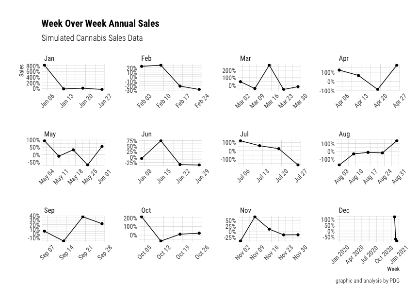

Part 2 - Visualize Cannabis Data
================
Martin Frigaard
current version: 2020-03-19

## Load the packages

These are the packages we will use to visualize the cannabis data.

``` r
library(readr)
library(tidyverse)
library(lubridate)
library(ggthemes)
library(cluster)
library(factoextra)
library(textshape)
library(knitr)
library(rmdformats)
library(plotly)
require(janitor)
require(skimr)
library(mosaic)
library(inspectdf)
library(visdat)
library(DT)
library(hrbrthemes)
```

## Import data

This data came from a UK e-commerce dataset from the [UCI Machine
Learning
Laboratory](https://archive.ics.uci.edu/ml/datasets/online+retail) and
the [kushy cannabis data
set](https://github.com/kushyapp/cannabis-dataset).

``` r
# fs::dir_tree("data/processed/")
CannabisWowData <- read_csv("data/processed/2020-03-17-CannabisWowData.csv")
```

``` r
CannabisWowData %>% utils::str() 
```

    #>  Classes 'spec_tbl_df', 'tbl_df', 'tbl' and 'data.frame':    2799 obs. of  21 variables:
    #>  $ id : num 404 404 404 404 404 404 216 216 ...
    #>  $ location : chr "California" "California" "California" ...
    #>  $ quantity : num 1296 600 600 480 ...
    #>  $ unit_price : num 1.06 0.42 1.79 0.36 0.42 2.55 0.39 1.74 ...
    #>  $ cost_per_invoice: num 1374 252 1074 173 ...
    #>  $ product_name : chr "Sour Diesel" "Sour Diesel" "Sour Diesel" ...
    #>  $ prod_name_count : num 480 480 480 480 480 480 423 423 ...
    #>  $ product_category: chr "Flowers" "Flowers" "Flowers" ...
    #>  $ invoice_date : Date, format: "2020-10-07" "2020-07-24" ...
    #>  $ dow : num 7 24 6 18 18 6 28 11 ...
    #>  $ week : num 41 30 40 16 12 49 44 41 ...
    #>  $ yr : num 2020 2020 2020 2020 2020 2020 2020 2020 ...
    #>  $ week_year : Date, format: "2020-10-04" "2020-07-19" ...
    #>  $ month : chr "Oct" "Jul" "Oct" ...
    #>  $ floor_month : Date, format: "2020-10-01" "2020-07-01" ...
    #>  $ invoice_no : num 570097 561051 569815 550344 ...
    #>  $ stock_code : chr "20971" "21977" "85099F" ...
    #>  $ product_details : chr "Pre-roll" "Pre-roll" "Pre-roll" ...
    #>  $ brand : chr "Medi Cone" "Medi Cone" "Medi Cone" ...
    #>  $ brand_name : chr "Day Dreamers" "Day Dreamers" "Day Dreamers" ...
    #>  $ brand_category : chr "Concentrates" "Edibles" "Medical" ...
    #>  - attr(*, "problems")=Classes 'tbl_df', 'tbl' and 'data.frame': 35 obs. of 5
    #>     variables:
    #>  ..$ row : int 2757 2758 2759 2760 2761 2762 2763 2764 ...
    #>  ..$ col : chr "invoice_no" "invoice_no" "invoice_no" ...
    #>  ..$ expected: chr "a double" "a double" "a double" ...
    #>  ..$ actual : chr "C548695" "C575651" "C541090" ...
    #>  ..$ file : chr "'data/processed/2020-03-17-CannabisWowData.csv'"
    #>     "'data/processed/2020-03-17-CannabisWowData.csv'"
    #>     "'data/processed/2020-03-17-CannabisWowData.csv'" ...
    #>  - attr(*, "spec")=
    #>  .. cols(
    #>  ..  id = col_double(),
    #>  ..  location = col_character(),
    #>  ..  quantity = col_double(),
    #>  ..  unit_price = col_double(),
    #>  ..  cost_per_invoice = col_double(),
    #>  ..  product_name = col_character(),
    #>  ..  prod_name_count = col_double(),
    #>  ..  product_category = col_character(),
    #>  ..  invoice_date = col_date(format = ""),
    #>  ..  dow = col_double(),
    #>  ..  week = col_double(),
    #>  ..  yr = col_double(),
    #>  ..  week_year = col_date(format = ""),
    #>  ..  month = col_character(),
    #>  ..  floor_month = col_date(format = ""),
    #>  ..  invoice_no = col_double(),
    #>  ..  stock_code = col_character(),
    #>  ..  product_details = col_character(),
    #>  ..  brand = col_character(),
    #>  ..  brand_name = col_character(),
    #>  ..  brand_category = col_character()
    #>  .. )

This `data.frame` is a combination of some sales data with some product
and brand data.

``` r
CannabisWowData %>% 
  dplyr::count(brand_category, sort = TRUE) %>% 
  dplyr::mutate(brand_category = reorder(brand_category, n)) %>%
  ggplot2::ggplot(aes(x = brand_category, y = n)) +
    ggplot2::geom_col(aes(fill = brand_category), 
                      show.legend = FALSE) +
    ggplot2::labs(x = "Brand Category",
                  y = "Count",
                  title = "Most Common Cannabis Brand Categories") +
    ggplot2::coord_flip()
```

<!-- -->

This tells me there are 17 different categories for brands, and
`Concentrates` are the most common brand category. I can also see
`Flower` and `Edibles` are numbers two and three.

``` r
CannabisWowData %>% 
  dplyr::count(product_category, sort = TRUE) %>% 
  dplyr::mutate(product_category = reorder(product_category, n)) %>%
  ggplot2::ggplot(aes(x = product_category, y = n)) +
    ggplot2::geom_col(aes(fill = product_category), 
                      show.legend = FALSE) +
    ggplot2::labs(x = "Product Category",
                  y = "Count",
                  title = "Most Common Cannabis Product Categories") +
    ggplot2::coord_flip()
```

<!-- -->

## Creating week over week data

The code below creates a data.frame that is ‘week-over-week’, which is
not an uncommon way of reporting sales data.

``` r
WeekOverWeek <- CannabisWowData %>%
    # get the week_year by quantity
  select(week_year, quantity) %>%
    # group these data
  group_by(week_year) %>%
    # summarize the data by weekly quantity
  summarize(week_qty = sum(quantity)) %>%
    # This introduces the lag function, 
    # Compute a lagged version of a time series, shifting the time base 
    # back by a given number of observations.
  mutate(prev_week = lag(week_qty, 1)) %>%
    # now we get the ratio of the difference between the weekly quantity and 
    # the previous week, and we divide that by the previous week.
  mutate(wow_quantity = (week_qty - prev_week) / prev_week) %>%
    # now we calculate the month, using week_year, abbreviations, and labels
  mutate(month = month(week_year, abbr = TRUE, label = TRUE)) %>%
    # and we group this final data set by the week_year variable
  group_by(week_year)
# check this data set
WeekOverWeek %>% utils::str()
```

    #>  Classes 'grouped_df', 'tbl_df', 'tbl' and 'data.frame': 52 obs. of  5 variables:
    #>  $ week_year : Date, format: "2019-12-29" "2020-01-05" ...
    #>  $ week_qty : num 47 432 366 400 260 320 402 318 ...
    #>  $ prev_week : num NA 47 432 366 400 260 320 402 ...
    #>  $ wow_quantity: num NA 8.1915 -0.1528 0.0929 ...
    #>  $ month : Ord.factor w/ 12 levels "Jan"<"Feb"<"Mar"<..: 12 1 1 1 1 2 2 2 ...
    #>  - attr(*, "groups")=Classes 'tbl_df', 'tbl' and 'data.frame': 52 obs. of 2
    #>     variables:
    #>  ..$ week_year: Date, format: "2019-12-29" "2020-01-05" ...
    #>  ..$ .rows :List of 52
    #>  .. ..$ : int 1
    #>  .. ..$ : int 2
    #>  .. ..$ : int 3
    #>  .. ..$ : int 4
    #>  .. ..$ : int 5
    #>  .. ..$ : int 6
    #>  .. ..$ : int 7
    #>  .. ..$ : int 8
    #>  .. ..$ : int 9
    #>  .. ..$ : int 10
    #>  .. ..$ : int 11
    #>  .. ..$ : int 12
    #>  .. ..$ : int 13
    #>  .. ..$ : int 14
    #>  .. ..$ : int 15
    #>  .. ..$ : int 16
    #>  .. ..$ : int 17
    #>  .. ..$ : int 18
    #>  .. ..$ : int 19
    #>  .. ..$ : int 20
    #>  .. ..$ : int 21
    #>  .. ..$ : int 22
    #>  .. ..$ : int 23
    #>  .. ..$ : int 24
    #>  .. ..$ : int 25
    #>  .. ..$ : int 26
    #>  .. ..$ : int 27
    #>  .. ..$ : int 28
    #>  .. ..$ : int 29
    #>  .. ..$ : int 30
    #>  .. ..$ : int 31
    #>  .. ..$ : int 32
    #>  .. ..$ : int 33
    #>  .. ..$ : int 34
    #>  .. ..$ : int 35
    #>  .. ..$ : int 36
    #>  .. ..$ : int 37
    #>  .. ..$ : int 38
    #>  .. ..$ : int 39
    #>  .. ..$ : int 40
    #>  .. ..$ : int 41
    #>  .. ..$ : int 42
    #>  .. ..$ : int 43
    #>  .. ..$ : int 44
    #>  .. ..$ : int 45
    #>  .. ..$ : int 46
    #>  .. ..$ : int 47
    #>  .. ..$ : int 48
    #>  .. ..$ : int 49
    #>  .. ..$ : int 50
    #>  .. ..$ : int 51
    #>  .. ..$ : int 52
    #>  ..- attr(*, ".drop")= logi TRUE

Here we see there is a data.frame with 52 rows (one for each week).

## Plot annual sales (by week)

These are the annual sales (line plots) by week, faceted by month.

``` r
# set theme
ggplot2::theme_set(hrbrthemes::theme_ipsum_rc(
  base_size = 9,
  strip_text_size = 10,
  axis_title_size = 9,
  plot_title_size = 13,
  subtitle_size = 11
))
```

``` r
  # these are the labels
labs_wow_annual_sales <- ggplot2::labs(
  y = 'Sales', 
  x = 'Week', 
  title = 'Week Over Week Annual Sales',
  subtitle = "Simulated Cannabis Sales Data",
  caption = "graphic and analysis by PDG") 

ggWoWAnnualSales <- WeekOverWeek %>% 
  # this will put week_year on the x
    ggplot2::ggplot(aes(x = week_year, 
                        # and the week over week quantity on the y
                        y = wow_quantity)) +
  # add the line plot
    ggplot2::geom_line() +
  # and the point
    ggplot2::geom_point() +
  # the axis title here will inherit the size and color
    ggplot2::theme(axis.title = element_text(face = c("bold"))) +
  # this will remove the legend
    ggplot2::theme(legend.title = element_blank()) +
  # this adds the percent on the y axis
    ggplot2::scale_y_continuous(labels = scales::percent_format(accuracy = 1),) +
  # here we facet by the month
    ggplot2::facet_wrap(. ~ month, 
                        # 
                        scales = "free") + 
    ggplot2::theme(axis.text.x = 
                     element_text(angle = 45, 
                                  hjust = 0.5, 
                                  vjust = 0.5)) +
  labs_wow_annual_sales
ggWoWAnnualSales 
```

<!-- -->

This shows some missing data in December, and a lot of variance in the
sales from month to month. We can check the missing data for December
using the graph below

``` r
WeekOverWeek %>% 
  dplyr::filter(month == "Dec") %>% 
  # this will put week_year on the x
    ggplot2::ggplot(aes(x = week_year, 
                        # and the week over week quantity on the y
                        y = wow_quantity)) +
  # add the line plot
    ggplot2::geom_line() +
  # and the point
    ggplot2::geom_point() +
  # the axis title here will inherit the size and color
    ggplot2::theme(axis.title = element_text(face = c("bold"))) +
  # this will remove the legend
    ggplot2::theme(legend.title = element_blank()) +
  # this adds the percent on the y axis
    ggplot2::scale_y_continuous(labels = scales::percent_format(accuracy = 1))
```

<!-- -->

Now we’re wondering what the quantity sold per week is, and we can get
this with `week_year` and `week_qty`.

``` r
labs_quantity_per_week <- ggplot2::labs(
         x = "Week", 
         y = "Quantity Sold",
         title = "Quantity Per Week") 

ggWowQuantity <- WeekOverWeek %>%
  # drop missing
    tidyr::drop_na() %>%
  # plot week_year on the x
    ggplot2::ggplot(data = ., 
           aes(x = week_year, 
               # and week quantity on the y
               y = week_qty)) + 
  # add the line plot
    ggplot2::geom_line() +
  # add the smooth (predictor)
    ggplot2::geom_smooth() +
  # add points
    ggplot2::geom_point() +
    labs_quantity_per_week
ggWowQuantity
```

<!-- -->

These were used in the previous graph:

``` r
    stat_summary(fun.y = mean,
                 geom = "bar") +
    stat_summary(fun.data = mean_cl_boot,
                 geom = "errorbar",
                 width = 0.3) +
```

But I opted for the line + points.

## Create Monthly Sales by Location

Next we create the monthly sales data frame, with the `unit_price`,
`quantity`, `location`, and `floor_month`.

``` r
MonthlyLocationSales <- CannabisWowData %>% 
    # get the floor_month. location, quantity, and unit_price
    dplyr::select(floor_month, 
                  location, 
                  quantity,  
                  unit_price) %>%
    # we can create the "sales"
    dplyr::mutate(sales = quantity*unit_price) %>%
    # now we group by the floor_month and location
    dplyr::group_by(floor_month, location) %>%
    # and summarize this by the monthly_sales and median sales
    dplyr::summarize(total_monthly_sales = sum(sales, na.rm = TRUE), 
                     median_monthly_sales = median(sales, na.rm = TRUE)) %>%
    # and group it by the floor_month and location
    dplyr::group_by(floor_month, location) %>% 
    # remove the SP location
    dplyr::filter(location != "SP")
# check new data 
MonthlyLocationSales %>% dplyr::glimpse(78)
```

    #>  Observations: 138
    #>  Variables: 4
    #>  Groups: floor_month, location [138]
    #>  $ floor_month          <date> 2019-12-01, 2019-12-01, 2020-01-01, 2020-01-0…
    #>  $ location             <chr> "California", "Washington", "Arizona", "Britis…
    #>  $ total_monthly_sales  <dbl> 30.18, 19.45, 149.95, 122.22, 1477.13, 140.53,…
    #>  $ median_monthly_sales <dbl> 12.960, 9.725, 13.800, 31.200, 6.960, 5.405, 5…

This gives us a grouped `data.frame` with 138 rows.

## Plot Monthly Sales by Location

This plot will graph the monthly sales of cannabis products by their
location (abbreviated).

``` r
# labels
labs_monthly_location_sales <- ggplot2::labs(y = 'Total Monthly Sales',
                  x = 'Month',
                  title = 'Total Monthly Sales By Location')

# plot
ggTop100MonthlyLocationSales <- MonthlyLocationSales %>%
    # sort these by total_monthly_sales
    dplyr::arrange(desc(total_monthly_sales)) %>% 
    # plot this as floor_month vs. monthly sales
    ggplot2::ggplot(data = ., 
                    # month
                    aes(x = floor_month, 
                        # total monthly sales here
                        y = total_monthly_sales)) +
    # add a line
    ggplot2::geom_line() +
    # and a point
    ggplot2::geom_point() +
    # and a theme
    ggplot2::theme(axis.title = 
                     element_text()) +   
    # with legend title
    ggplot2::theme(legend.title = 
                     element_blank()) +
    # and the scales for dollar formats
    ggplot2::scale_y_continuous(labels = 
                                  scales::dollar_format(accuracy = 1)) +
    # facet by the location
    ggplot2::facet_wrap(. ~ location, 
                        scales = "free", 
                        ncol = 4) + 
    # adjust the x axis text
    ggplot2::theme(axis.text.x = 
                     element_text(angle = 45, 
                                  hjust = 0.5, 
                                  vjust = 0.5)) +
    # 
    labs_monthly_location_sales
ggTop100MonthlyLocationSales 
```

<!-- -->

Faceting by location and having months on the x axis is helpful for
spotting trends, but graphs like this can help us spot gaps in total
sales by location (i.e. California vs. Manitoba).

## Median Order Sales by Location

This is the median sales by `floor_month`, sorted by the `median_sales`.

``` r
# labels
labs_median_order_value <- ggplot2::labs(
                  y = 'Median Monthly Sales', 
                  x = 'Floor Month',
                  title = 'Median Monthly Sales by Location')
# plot
ggMedianOrderValue <- MonthlyLocationSales %>%
    # sort these by median_sales
    dplyr::arrange(desc(median_monthly_sales)) %>% 
    # plot
    ggplot2::ggplot(data = ., 
                    # put months on the x 
           mapping = aes(x = floor_month, 
                         # median monthly sales
                         y = median_monthly_sales)) +
    # add the line
    ggplot2::geom_line() +
    # add the point
    ggplot2::geom_point() +
    # add the y format
    ggplot2::scale_y_continuous(labels = 
                                    scales::dollar_format(accuracy = 1)) +
  
    # facet this by the location and set scales to free
    ggplot2::facet_wrap(. ~ location, 
                        scales = "free") + 
  
      # adjust the x axis text
    ggplot2::theme(axis.text.x = 
                     element_text(angle = 45, 
                                  hjust = 0.5, 
                                  vjust = 0.5)) +
  # add the labels
  labs_median_order_value

ggMedianOrderValue
```

<!-- -->

## Create Customer Sales data

These data are the sales by customer id. We create this data frame by
grouping on `customer_id`, then create a `sales` variable by multiplying
the quantity by the unit price (`quantity * unit_price`).

We also create three variables that aggregate the sales (`sum` and
`median`).

``` r
CustomerSales <- CannabisWowData %>%
    # select the customer_id, quantity, and unit_price
    dplyr::select(id, quantity, unit_price) %>%
    # group it by the customer id
    dplyr::group_by(id) %>%
    # create sales (which is the product of quantity and price)
    dplyr::mutate(sales = (quantity * unit_price)) %>%
    # summarize
    dplyr::summarize(
            sales_sum = sum(sales),
            sales_median = median(sales),
            quantity_sum = sum(quantity),
            quantiy_median = median(quantity)) %>%
    # we group this again by customer id
    dplyr::group_by(id)
CustomerSales %>% dplyr::glimpse(78)
```

    #>  Observations: 1,253
    #>  Variables: 5
    #>  Groups: id [1,253]
    #>  $ id             <dbl> 1, 7, 8, 9, 15, 16, 17, 18, 19, 22, 25, 27, 28, 29, …
    #>  $ sales_sum      <dbl> 11.58, 13.24, 4.95, 32.85, 5.40, 2.49, 17.70, 3.36, …
    #>  $ sales_median   <dbl> 5.790, 6.620, 4.950, 32.850, 2.700, 2.490, 17.700, 3…
    #>  $ quantity_sum   <dbl> 2, 2, 3, 3, 2, 1, 6, 1, 1, 1, 1, 12, 4, 2, 2, 8, 2, …
    #>  $ quantiy_median <dbl> 1, 1, 3, 3, 1, 1, 6, 1, 1, 1, 1, 6, 1, 1, 1, 1, 1, 1…

## Customer location data

We now join the `CustomerSales` data to a data frame with the distinct
customer ids and countries (`CustomersLocation`).

``` r
CustomersLocation <- CannabisWowData %>%
    dplyr::distinct(id, location) %>%
    dplyr::group_by(id)
# join this to the CustomersLocation
CustomersSalesLocation <- CustomerSales %>%
    dplyr::inner_join(CustomersLocation, 
               by = "id")
# check
CustomersSalesLocation %>% dplyr::glimpse(78)
```

    #>  Observations: 1,253
    #>  Variables: 6
    #>  Groups: id [1,253]
    #>  $ id             <dbl> 1, 7, 8, 9, 15, 16, 17, 18, 19, 22, 25, 27, 28, 29, …
    #>  $ sales_sum      <dbl> 11.58, 13.24, 4.95, 32.85, 5.40, 2.49, 17.70, 3.36, …
    #>  $ sales_median   <dbl> 5.790, 6.620, 4.950, 32.850, 2.700, 2.490, 17.700, 3…
    #>  $ quantity_sum   <dbl> 2, 2, 3, 3, 2, 1, 6, 1, 1, 1, 1, 12, 4, 2, 2, 8, 2, …
    #>  $ quantiy_median <dbl> 1, 1, 3, 3, 1, 1, 6, 1, 1, 1, 1, 6, 1, 1, 1, 1, 1, 1…
    #>  $ location       <chr> "California", "California", "California", "Californi…

### Create cluster (modeling) data frame

Ok, now we are going to convert the grouped data frame, drop the missing
rows, and remove any data where sales were less than zero.

``` r
# convert to data frame
CustomerSalesClust <- base::data.frame(CustomerSales)

CustomerSalesClust <- CustomerSalesClust %>%  
    # drop na 
                        tidyr::drop_na() %>%
    # remove sales less than 0
                        dplyr::filter(sales_sum > 0)
skimr::skim(CustomerSalesClust)
```

|                                                  |                    |
| :----------------------------------------------- | :----------------- |
| Name                                             | CustomerSalesClust |
| Number of rows                                   | 1222               |
| Number of columns                                | 5                  |
| \_\_\_\_\_\_\_\_\_\_\_\_\_\_\_\_\_\_\_\_\_\_\_   |                    |
| Column type frequency:                           |                    |
| numeric                                          | 5                  |
| \_\_\_\_\_\_\_\_\_\_\_\_\_\_\_\_\_\_\_\_\_\_\_\_ |                    |
| Group variables                                  | None               |

Data summary

**Variable type: numeric**

| skim\_variable  | n\_missing | complete\_rate |   mean |     sd |   p0 |    p25 |    p50 |     p75 |    p100 | hist  |
| :-------------- | ---------: | -------------: | -----: | -----: | ---: | -----: | -----: | ------: | ------: | :---- |
| id              |          0 |              1 | 861.03 | 487.61 | 1.00 | 440.50 | 873.50 | 1282.75 | 1680.00 | ▇▇▇▇▇ |
| sales\_sum      |          0 |              1 |  43.86 | 139.07 | 0.39 |   7.37 |  19.09 |   39.80 | 3635.76 | ▇▁▁▁▁ |
| sales\_median   |          0 |              1 |  16.58 |  39.93 | 0.39 |   4.13 |   9.87 |   16.65 |  757.63 | ▇▁▁▁▁ |
| quantity\_sum   |          0 |              1 |  23.30 | 114.16 | 1.00 |   2.00 |   6.00 |   20.00 | 3576.00 | ▇▁▁▁▁ |
| quantiy\_median |          0 |              1 |   8.27 |  21.13 | 1.00 |   1.00 |   3.00 |    9.75 |  540.00 | ▇▁▁▁▁ |

## k-means clustering

Finally, we run a k-means clustering algorithm on the clustered sales
data. *What does a k-means clustering do?* Well, here is a great
definition on
[Medium](https://towardsdatascience.com/understanding-k-means-clustering-in-machine-learning-6a6e67336aa1),

> the objective of K-means is simple: group similar data points together
> and discover underlying patterns. To achieve this objective, K-means
> looks for a fixed number (k) of clusters in a dataset.

The k-means algorithm is an **unsupervised machine learning algorithm.**
The steps to perform this are:

1.  Use the `textshape::column_to_rownames()` function on the clustered
    data frame. This function

> “*Takes an existing column and uses it as rownames instead. This is
> useful when turning a data.frame into a matrix. Inspired by the tibble
> package’s `column_to_row` which is now deprecated if done on a
> `tibble` object. By coercing to a `data.frame` this problem is
> avoided.*”

We’re going to use the non-descript name, `CustomerSalesClust2`. to show
what this function is actually doing. The `utils::str()` function gives
us some information on what kind of object we’ve created here.

``` r
CustomerSalesClust2 <- textshape::column_to_rownames(CustomerSalesClust) 
utils::str(CustomerSalesClust)
```

    #>  'data.frame':   1222 obs. of  5 variables:
    #>  $ id : num 1 7 8 9 15 16 17 18 ...
    #>  $ sales_sum : num 11.58 13.24 4.95 32.85 ...
    #>  $ sales_median : num 5.79 6.62 4.95 32.85 ...
    #>  $ quantity_sum : num 2 2 3 3 2 1 6 1 ...
    #>  $ quantiy_median: num 1 1 3 3 1 1 6 1 ...

``` r
utils::str(CustomerSalesClust2)
```

    #>  'data.frame':   1222 obs. of  4 variables:
    #>  $ sales_sum : num 11.58 13.24 4.95 32.85 ...
    #>  $ sales_median : num 5.79 6.62 4.95 32.85 ...
    #>  $ quantity_sum : num 2 2 3 3 2 1 6 1 ...
    #>  $ quantiy_median: num 1 1 3 3 1 1 6 1 ...

The `CustomerSalesClust2` took the existing data frame
(`CustomerSalesClust`) and removed a column (`customer_id`) and assigned
them a rowname `base::rownames()`.

``` r
base::rownames(CustomerSalesClust2) %>% head()
```

    #>  [1] "1"  "7"  "8"  "9"  "15" "16"

2.  The 2nd step is to Scale the new `CustomerSalesClust` with
    `base::scale()`, which now has been transformed via the
    `textshape::column_to_rownames()` function. The `scale()` function
    who’s, “*default method centers and/or scales the columns of a
    numeric matrix.*”

<!-- end list -->

``` r
CustomerSalesClust3 <- base::scale(CustomerSalesClust2)
str(CustomerSalesClust3)
```

    #>  num [1:1222, 1:4] -0.2321 -0.2202 -0.2798 -0.0792 ...
    #>  - attr(*, "dimnames")=List of 2
    #>  ..$ : chr [1:1222] "1" "7" "8" ...
    #>  ..$ : chr [1:4] "sales_sum" "sales_median" "quantity_sum" ...
    #>  - attr(*, "scaled:center")= Named num [1:4] 43.86 16.58 23.3 8.27
    #>  ..- attr(*, "names")= chr [1:4] "sales_sum" "sales_median" "quantity_sum" ...
    #>  - attr(*, "scaled:scale")= Named num [1:4] 139.1 39.9 114.2 21.1
    #>  ..- attr(*, "names")= chr [1:4] "sales_sum" "sales_median" "quantity_sum" ...

Use the `kmeans()` function with the specifications below:

`centers` = A matrix of cluster centres. `nstart` =

``` r
k2 <- kmeans(CustomerSalesClust, 
             # the number of cluster centries
             centers = 2 , 
             ## random starts do help here with too many clusters
             ## (and are often recommended anyway!):
             nstart = 25)
k2
```

    #>  K-means clustering with 2 clusters of sizes 592, 630
    #>  
    #>  Cluster means:
    #>           id sales_sum sales_median quantity_sum quantiy_median
    #>  1  425.8666  51.25693     19.20398     29.82939        9.88598
    #>  2 1269.9476  36.90537     14.11969     17.16349        6.75000
    #>  
    #>  Clustering vector:
    #>     [1] 1 1 1 1 1 1 1 1 1 1 1 1 1 1 1 1 1 1 1 1 1 1 1 1 1 1 1 1 1 1 1 1 1 1 1 1 1
    #>    [38] 1 1 1 1 1 1 1 1 1 1 1 1 1 1 1 1 1 1 1 1 1 1 1 1 1 1 1 1 1 1 1 1 1 1 1 1 1
    #>    [75] 1 1 1 1 1 1 1 1 1 1 1 1 1 1 1 1 1 1 1 1 1 1 1 1 1 1 1 1 1 1 1 1 1 1 1 1 1
    #>   [112] 1 1 1 1 1 1 1 1 1 1 1 1 1 1 1 1 1 1 1 1 1 1 1 1 1 1 1 1 1 1 1 1 1 1 1 1 1
    #>   [149] 1 1 1 1 1 1 1 1 1 1 1 1 1 1 1 1 1 1 1 1 1 1 1 1 1 1 1 1 1 1 1 1 1 1 1 1 1
    #>   [186] 1 1 1 1 1 1 1 1 1 1 1 1 1 1 1 1 1 1 1 1 1 1 1 1 1 1 1 1 1 1 1 1 1 1 1 1 1
    #>   [223] 1 1 1 1 1 1 1 1 1 1 1 1 1 1 1 1 1 1 1 1 1 1 1 1 1 1 1 1 1 1 1 1 1 1 1 1 1
    #>   [260] 1 1 1 1 1 1 1 1 1 1 1 1 1 1 1 1 1 1 1 1 1 1 1 1 1 1 1 1 1 1 1 1 1 1 1 1 1
    #>   [297] 1 1 1 1 1 1 1 1 1 1 1 1 1 1 1 1 1 1 1 1 1 1 1 1 1 1 1 1 1 1 1 1 1 1 1 1 1
    #>   [334] 1 1 1 1 1 1 1 1 1 1 1 1 1 1 1 1 1 1 1 1 1 1 1 1 1 1 1 1 1 1 1 1 1 1 1 1 1
    #>   [371] 1 1 1 1 1 1 1 1 1 1 1 1 1 1 1 1 1 1 1 1 1 1 1 1 1 1 1 1 1 1 1 1 1 1 1 1 1
    #>   [408] 1 1 1 1 1 1 1 1 1 1 1 1 1 1 1 1 1 1 1 1 1 1 1 1 1 1 1 1 1 1 1 1 1 1 1 1 1
    #>   [445] 1 1 1 1 1 1 1 1 1 1 1 1 1 1 1 1 1 1 1 1 1 1 1 1 1 1 1 1 1 1 1 1 1 1 1 1 1
    #>   [482] 1 1 1 1 1 1 1 1 1 1 1 1 1 1 1 1 1 1 1 1 1 1 1 1 1 1 1 1 1 1 1 1 1 1 1 1 1
    #>   [519] 1 1 1 1 1 1 1 1 1 1 1 1 1 1 1 1 1 1 1 1 1 1 1 1 1 1 1 1 1 1 1 1 1 1 1 1 1
    #>   [556] 1 1 1 1 1 1 1 1 1 1 1 1 1 1 1 1 1 1 1 1 1 1 1 1 1 1 1 1 1 1 1 1 1 1 1 1 1
    #>   [593] 2 2 2 2 2 2 2 2 2 2 2 2 2 2 2 2 2 2 2 2 2 2 2 2 2 2 2 2 2 2 2 2 2 2 2 2 2
    #>   [630] 2 2 2 2 2 2 2 2 2 2 2 2 2 2 2 2 2 2 2 2 2 2 2 2 2 2 2 2 2 2 2 2 2 2 2 2 2
    #>   [667] 2 2 2 2 2 2 2 2 2 2 2 2 2 2 2 2 2 2 2 2 2 2 2 2 2 2 2 2 2 2 2 2 2 2 2 2 2
    #>   [704] 2 2 2 2 2 2 2 2 2 2 2 2 2 2 2 2 2 2 2 2 2 2 2 2 2 2 2 2 2 2 2 2 2 2 2 2 2
    #>   [741] 2 2 2 2 2 2 2 2 2 2 2 2 2 2 2 2 2 2 2 2 2 2 2 2 2 2 2 2 2 2 2 2 2 2 2 2 2
    #>   [778] 2 2 2 2 2 2 2 2 2 2 2 2 2 2 2 2 2 2 2 2 2 2 2 2 2 2 2 2 2 2 2 2 2 2 2 2 2
    #>   [815] 2 2 2 2 2 2 2 2 2 2 2 2 2 2 2 2 2 2 2 2 2 2 2 2 2 2 2 2 2 2 2 2 2 2 2 2 2
    #>   [852] 2 2 2 2 2 2 2 2 2 2 2 2 2 2 2 2 2 2 2 2 2 2 2 2 2 2 2 2 2 2 2 2 2 2 2 2 2
    #>   [889] 2 2 2 2 2 2 2 2 2 2 2 2 2 2 2 2 2 2 2 2 2 2 2 2 2 2 2 2 2 2 2 2 2 2 2 2 2
    #>   [926] 2 2 2 2 2 2 2 2 2 2 2 2 2 2 2 2 2 2 2 2 2 2 2 2 2 2 2 2 2 2 2 2 2 2 2 2 2
    #>   [963] 2 2 2 2 2 2 2 2 2 2 2 2 2 2 2 2 2 2 2 2 2 2 2 2 2 2 2 2 2 2 2 2 2 2 2 2 2
    #>  [1000] 2 2 2 2 2 2 2 2 2 2 2 2 2 2 2 2 2 2 2 2 2 2 2 2 2 2 2 2 2 2 2 2 2 2 2 2 2
    #>  [1037] 2 2 2 2 2 2 2 2 2 2 2 2 2 2 2 2 2 2 2 2 2 2 2 2 2 2 2 2 2 2 2 2 2 2 2 2 2
    #>  [1074] 2 2 2 2 2 2 2 2 2 2 2 2 2 2 2 2 2 2 2 2 2 2 2 2 2 2 2 2 2 2 2 2 2 2 2 2 2
    #>  [1111] 2 2 2 2 2 2 2 2 2 2 2 2 2 2 2 2 2 2 2 2 2 2 2 2 2 2 2 2 2 2 2 2 2 2 2 2 2
    #>  [1148] 2 2 2 2 2 2 2 2 2 2 2 2 2 2 2 2 2 2 2 2 2 2 2 2 2 2 2 2 2 2 2 2 2 2 2 2 2
    #>  [1185] 2 2 2 2 2 2 2 2 2 2 2 2 2 2 2 2 2 2 2 2 2 2 2 2 2 2 2 2 2 2 2 2 2 2 2 2 2
    #>  [1222] 2
    #>  
    #>  Within cluster sum of squares by cluster:
    #>  [1] 73977903 40773432
    #>   (between_SS / total_SS =  65.5 %)
    #>  
    #>  Available components:
    #>  
    #>  [1] "cluster"      "centers"      "totss"        "withinss"     "tot.withinss"
    #>  [6] "betweenss"    "size"         "iter"         "ifault"

``` r
fviz_cluster(k2, data = CustomerSalesClust3)
```

<!-- -->

``` r
CustomerSalesCluser <- base::data.frame(CustomerSalesClust, k2$cluster)
CustomerSalesCluser %>% dplyr::glimpse(78)
```

    #>  Observations: 1,222
    #>  Variables: 6
    #>  $ id             <dbl> 1, 7, 8, 9, 15, 16, 17, 18, 19, 22, 25, 27, 28, 29, …
    #>  $ sales_sum      <dbl> 11.58, 13.24, 4.95, 32.85, 5.40, 2.49, 17.70, 3.36, …
    #>  $ sales_median   <dbl> 5.790, 6.620, 4.950, 32.850, 2.700, 2.490, 17.700, 3…
    #>  $ quantity_sum   <dbl> 2, 2, 3, 3, 2, 1, 6, 1, 1, 1, 1, 12, 4, 2, 2, 8, 2, …
    #>  $ quantiy_median <dbl> 1, 1, 3, 3, 1, 1, 6, 1, 1, 1, 1, 6, 1, 1, 1, 1, 1, 1…
    #>  $ k2.cluster     <int> 1, 1, 1, 1, 1, 1, 1, 1, 1, 1, 1, 1, 1, 1, 1, 1, 1, 1…
