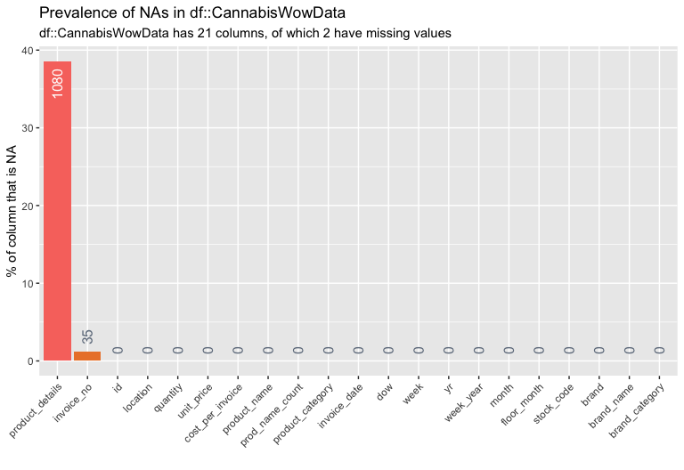
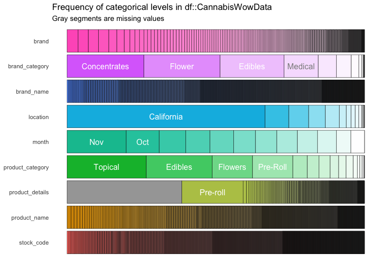
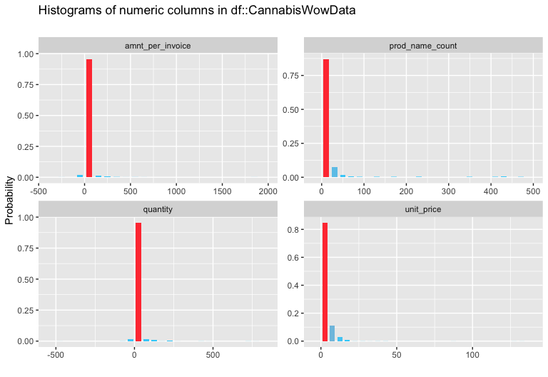

CanDash - Cannabis Dashboards
================

## Overview

File/folder structure

    #>  .
    #>  ├── 00-INSTALL.R
    #>  ├── 01-software-requirement-specifications.md
    #>  ├── 01-wrangle.Rmd
    #>  ├── 02-visualize.Rmd
    #>  ├── 02-visualize.md
    #>  ├── 03-k-means.Rmd
    #>  ├── 03-k-means.md
    #>  ├── CanDash.Rproj
    #>  ├── README.Rmd
    #>  ├── README.md
    #>  ├── code
    #>  ├── dashboard
    #>  ├── data
    #>  ├── docs
    #>  ├── figs
    #>  └── to-do.md

## The data

The data model for the CanDash application had to be constructed from a
few different sources. First, a list of products, brands, and other
categorical data were imported form the Kushy application on Github. You
can find the original data for this project
[here](https://github.com/kushyapp/cannabis-dataset).

We had to simulate the cost data for the products in the `Products` and
`Brands` tables. We used the online retail data from the [UCI Machine
Learning
Laboratory](https://archive.ics.uci.edu/ml/datasets/online+retail).

``` r
fs::dir_tree("data", recurse = TRUE)
```

    #>  data
    #>  ├── README.md
    #>  ├── kushy-datasets
    #>  │   ├── AUTHORS
    #>  │   ├── CHANGELOG.md
    #>  │   ├── LICENSE
    #>  │   ├── README.md
    #>  │   ├── csv
    #>  │   │   ├── brands-kushy_api.2017-11-14.csv
    #>  │   │   ├── products-kushy_api.2017-11-14.csv
    #>  │   │   ├── shops-kushy_api.2017-11-14.csv
    #>  │   │   └── strains-kushy_api.2017-11-14.csv
    #>  │   └── sql
    #>  │       ├── brands-kushy_api.2017-11-14.sql.gz
    #>  │       ├── products-kushy_api.2017-11-14.sql.gz
    #>  │       ├── shops-kushy_api.2017-11-14.sql.gz
    #>  │       └── strains-kushy_api.2017-11-14.sql.gz
    #>  ├── online-retail
    #>  │   ├── Online_Retail.csv
    #>  │   ├── README.md
    #>  │   ├── SmallOnlineRetail.csv
    #>  │   └── online-retail-data-set-from-uci-ml-repo.zip
    #>  └── processed
    #>      ├── 2020-03-17-CannabisWowData.csv
    #>      ├── 2020-03-19-CannabisWowData.csv
    #>      ├── 2020-03-19-MonthlyLocationSales.csv
    #>      ├── 2020-03-19-WeekOverWeek.csv
    #>      ├── 2020-03-21-Top50Data.csv
    #>      ├── 2020-04-17-CannabisWowData.csv
    #>      ├── 2020-04-17-MonthlyLocationSales.csv
    #>      ├── 2020-04-17-Top50Data.csv
    #>      ├── 2020-04-17-WeekOverWeek.csv
    #>      ├── 2020-04-21-MonthlyLocationSales.csv
    #>      ├── 2020-04-21-MonthlyLocationSales.rds
    #>      ├── 2020-04-21-Top100BrandCatsData.csv
    #>      ├── 2020-04-21-Top100BrandCatsData.rds
    #>      ├── 2020-04-21-Top25Data.csv
    #>      ├── 2020-04-21-Top25Data.rds
    #>      ├── 2020-04-21-Top50Data.csv
    #>      ├── 2020-04-21-Top50Data.rds
    #>      ├── 2020-04-21-WeekOverWeek.csv
    #>      └── 2020-04-21-WeekOverWeek.rds

## Import

The data for the dashboard are imported below.

``` r
# fs::dir_tree("data/processed/")
CannabisWowData <- read_csv("data/processed/2020-04-17-CannabisWowData.csv")
CannabisWowData %>% dplyr::glimpse(78)
```

    #>  Rows: 2,799
    #>  Columns: 21
    #>  $ id               <dbl> 404, 404, 404, 404, 404, 404, 216, 216, 216, 216, …
    #>  $ location         <chr> "California", "California", "California", "Califor…
    #>  $ quantity         <dbl> 800, 720, 720, 480, 400, 400, 288, 216, 200, 200, …
    #>  $ unit_price       <dbl> 0.00, 2.55, 0.85, 0.42, 1.25, 1.45, 0.10, 0.18, 1.…
    #>  $ amnt_per_invoice <dbl> 0.00, 1836.00, 612.00, 201.60, 500.00, 580.00, 28.…
    #>  $ product_name     <chr> "Sour Diesel", "Sour Diesel", "Sour Diesel", "Sour…
    #>  $ prod_name_count  <dbl> 480, 480, 480, 480, 480, 480, 423, 423, 423, 423, …
    #>  $ product_category <chr> "Flowers", "Flowers", "Flowers", "Pre-Roll", "Pre-…
    #>  $ invoice_date     <date> 2020-05-27, 2020-10-11, 2020-11-16, 2020-07-24, 2…
    #>  $ dow              <dbl> 27, 11, 16, 24, 10, 5, 1, 18, 7, 6, 23, 25, 2, 19,…
    #>  $ week             <dbl> 22, 41, 46, 30, 10, 40, 48, 42, 41, 45, 47, 30, 31…
    #>  $ yr               <dbl> 2020, 2020, 2020, 2020, 2020, 2020, 2020, 2020, 20…
    #>  $ week_year        <date> 2020-05-24, 2020-10-11, 2020-11-15, 2020-07-19, 2…
    #>  $ month            <chr> "May", "Oct", "Nov", "Jul", "Mar", "Oct", "Nov", "…
    #>  $ floor_month      <date> 2020-05-01, 2020-10-01, 2020-11-01, 2020-07-01, 2…
    #>  $ invoice_no       <dbl> 554857, 570557, 576827, 561055, 546154, 569570, 57…
    #>  $ stock_code       <chr> "POST", "22273", "21787", "23307", "62018", "22652…
    #>  $ product_details  <chr> "Pre-roll", "Pre-roll", "Pre-roll", "Pre-roll", "P…
    #>  $ brand            <chr> "Medi Cone", "Medi Cone", "Medi Cone", "Medi Cone"…
    #>  $ brand_name       <chr> "Day Dreamers", "Day Dreamers", "Day Dreamers", "D…
    #>  $ brand_category   <chr> "Concentrates", "Edibles", "Medical", "Concentrate…

## Date ranges

``` r
CannabisWowData %>% 
  dplyr::summarize(min_invoice_date = min(invoice_date, na.rm = TRUE),
                   max_invoice_date = max(invoice_date, na.rm = TRUE),
                   min_week_year = min(week_year, na.rm = TRUE),
                   max_week_year = max(week_year, na.rm = TRUE))
```

    #>  # A tibble: 1 x 4
    #>    min_invoice_date max_invoice_date min_week_year max_week_year
    #>    <date>           <date>           <date>        <date>       
    #>  1 2020-01-04       2020-12-23       2019-12-29    2020-12-20

These will help in determining what inputs to set on the dashboard.

### Missing data

These data are missing from the final `CannabisWowData`.

``` r
NAProducts <- inspectdf::inspect_na(df1 = CannabisWowData)
NAProducts %>% inspectdf::show_plot(text_labels = TRUE) 
```

<!-- -->

## Categorical data

These are the categorical variables in the `CannabisWowData`.

``` r
CannabisWowCats <- CannabisWowData %>% 
  dplyr::select_if(is.character) %>% 
  inspectdf::inspect_cat()
CannabisWowCats %>% inspectdf::show_plot(text_labels = TRUE) 
```

<!-- -->

We can see the overwhelming number of the data are from `California`, in
the months of `Nov/Oct`, etc.

## Numerical data

These are the categorical variables in the `CannabisWowData`.

``` r
CannabisWowNums <- CannabisWowData %>%
  # get numeric variables 
  dplyr::select(c(amnt_per_invoice, 
                  quantity, 
                  unit_price, 
                  prod_name_count)) %>% 
  inspectdf::inspect_num()
CannabisWowNums %>% 
  # plot these with color and layout
  inspectdf::show_plot(col_palette = 2, 
                       plot_layout = c(2, 2)) 
```

<!-- -->

Here we can see the `amnt_per_invoice`, `prod_name_count`, `quantity`,
and `unit_price` are skewed heavily towards 0.
