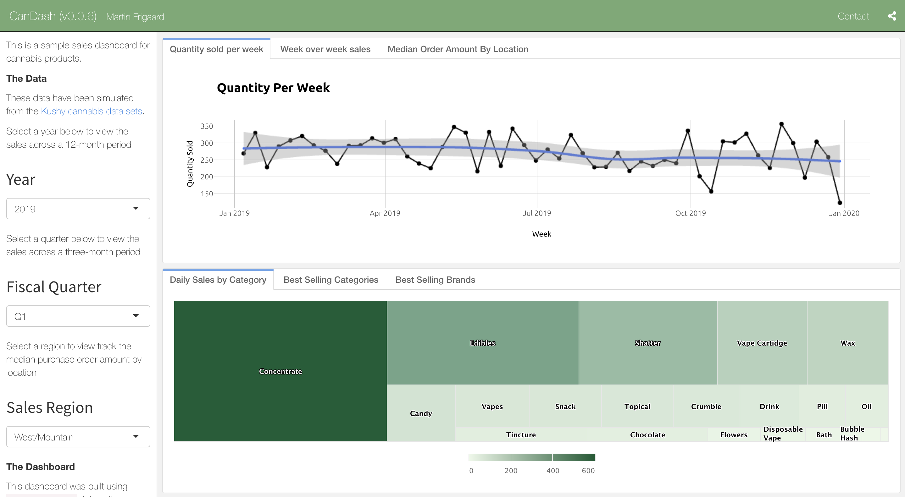

CanDash - Cannabis Dashboards
================

## Welcome to the `CanDash`\!

This is a
[`flexdashboard`](https://rmarkdown.rstudio.com/flexdashboard/) for
simulated sales cannabis data.

## The data

The data model for the `CanDash` application had to be constructed from
a few different sources. First, a list of products, brands, and other
categorical data were imported form the Kushy application on Github. You
can find the original data for this project
[here](https://github.com/kushyapp/cannabis-dataset).

We had to simulate the cost data for the products in the `Products` and
`Brands` tables. Read more about this process in the [`01.1-wrangle.md`
file](https://github.com/mjfrigaard/CanDash/blob/master/01.1-wrangle.md).

## The visualizations

All the visualizations were built in the
[`02-visualize.md`](https://github.com/mjfrigaard/CanDash/blob/master/02-visualize.md)
file using [`ggplot2`](https://ggplot2.tidyverse.org/),
[`plotly`](https://github.com/ropensci/plotly#readme), and
[`highcharter`](http://jkunst.com/highcharter/).

### Annual Trends (Units Sold)

### Quarterly Sales

### Orders By Location

### Top Daily Sales Categories

### Best Selling Categories (Per Day)

### Best Selling Brands (Per Month)

