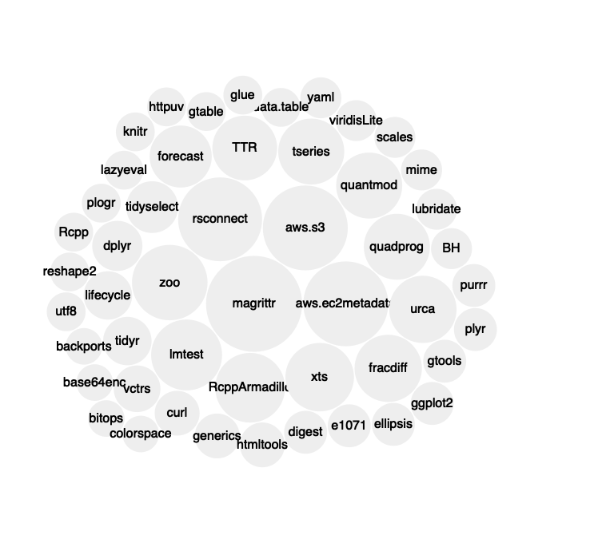
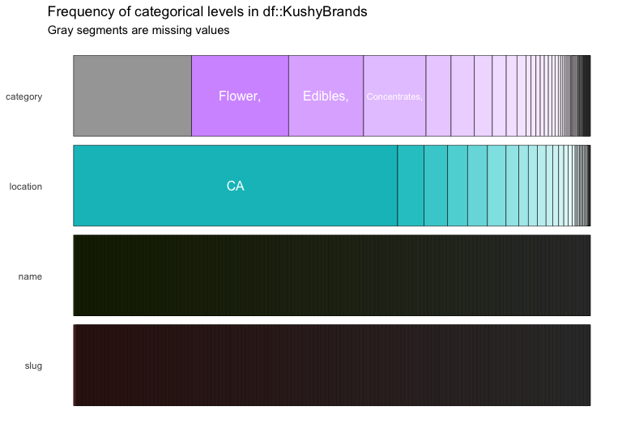
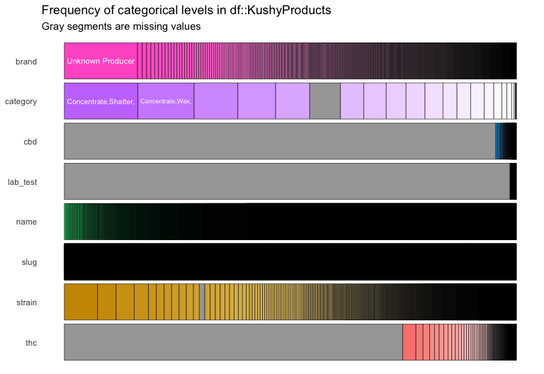
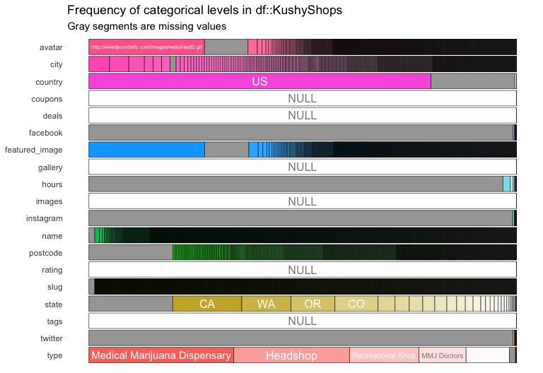
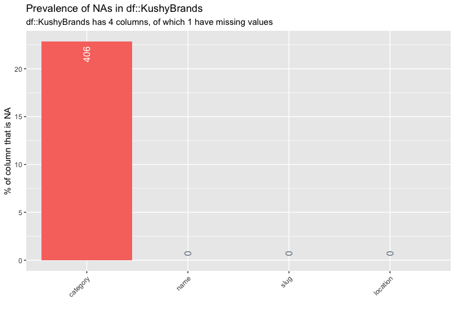
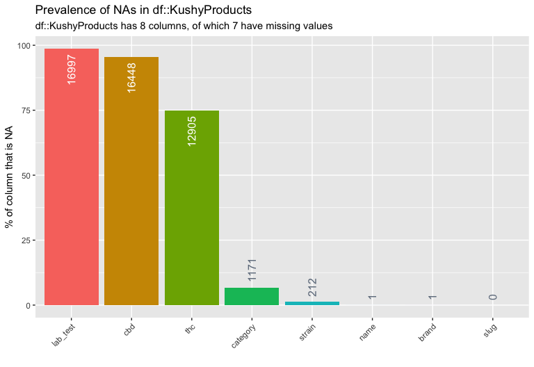
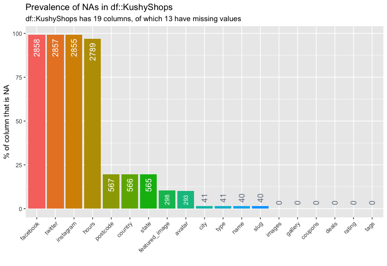
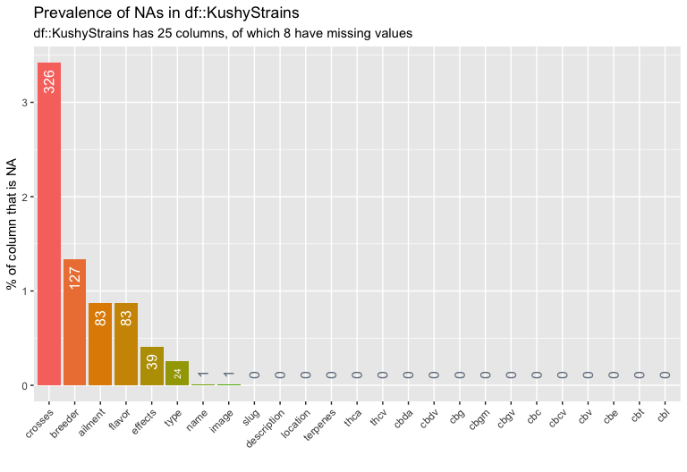

Shinydashboard for cannabis data
================
Martin Frigaard
2019-11-20

# Motivation

Document the app for Cannibus data.

## bloomfilter script

``` r
source("bloomfilter.R")
ls()
```

    #>  [1] "BloomFilter" "rawToInt"

``` r
source("global.R")
ls()
```

    #>  [1] "BloomFilter"   "downloadCount" "packageData"   "packageStream"
    #>  [5] "prototype"     "rawToInt"      "userCount"

## Import the `cranlog` data object

This will give us some data to play with.

``` r
# fs::dir_ls("data")
CranLog <- readr::read_csv("data/cranlog.csv") %>% 
    dplyr::select(-c(X1))
```

    #>  Parsed with column specification:
    #>  cols(
    #>    X1 = col_double(),
    #>    date = col_date(format = ""),
    #>    time = col_time(format = ""),
    #>    size = col_double(),
    #>    r_version = col_character(),
    #>    r_arch = col_character(),
    #>    r_os = col_character(),
    #>    package = col_character(),
    #>    version = col_character(),
    #>    country = col_character(),
    #>    ip_id = col_double(),
    #>    received = col_double()
    #>  )

``` r
CranLog %>% dplyr::glimpse(78)
```

    #>  Observations: 1,882
    #>  Variables: 11
    #>  $ date      <date> 2019-10-23, 2019-10-23, 2019-10-23, 2019-10-23, 2019-10-…
    #>  $ time      <time> 05:11:16, 05:11:16, 05:11:16, 05:11:16, 05:11:16, 05:11:…
    #>  $ size      <dbl> 1099904, 123306, 131294, 1350067, 1350068, 1350068, 13500…
    #>  $ r_version <chr> NA, NA, "3.5.0", "3.4.4", "3.6.1", "3.6.1", "3.6.1", "3.5…
    #>  $ r_arch    <chr> NA, NA, "x86_64", "x86_64", "x86_64", "x86_64", "x86_64",…
    #>  $ r_os      <chr> NA, NA, "linux-gnu", "linux-gnu", "mingw32", "mingw32", "…
    #>  $ package   <chr> "heuristicsmineR", "xaringan", "bibtex", "sandwich", "san…
    #>  $ version   <chr> "0.2.1", "0.12", "0.4.2", "2.5-1", "2.5-1", "2.5-1", "2.5…
    #>  $ country   <chr> "US", NA, "US", "HK", "HK", "HK", "HK", "HK", "HK", "HK",…
    #>  $ ip_id     <dbl> 44, 5, 52644, 66633, 66636, 66637, 66638, 66636, 66637, 6…
    #>  $ received  <dbl> 1574226677, 1574226677, 1574226677, 1574226677, 157422667…

## Bubbles plot

We can replace the `pkgData()` with `CranLog` in the code below:

``` r
    order <- unique(pkgData()$package)
    
    df <- pkgData() %>%
        
      group_by(package) %>%
        
      tally() %>%
        
      arrange(desc(n), tolower(package)) %>%
        
      # Just show the top 60, otherwise it gets hard to see
      head(60)

    bubbles(df$n, df$package, key = df$package)
```

``` r
# sort the CranLog by package
order <- unique(CranLog$package)

df <- CranLog %>%
      # df is grouped by package and...
      dplyr::group_by(package) %>%
      # tallied
      dplyr::tally() %>%
      # then arranged in descending order
      dplyr::arrange(desc(n), 
                     # then lower case all package chars
                     stringr::str_to_lower(package)) %>%
      # Just show the top 60, otherwise it gets hard to see
      utils::head(50)

bubbles::bubbles(value = df$n, 
        label = df$package, 
        key = df$package, 
        textColor = c("black"))
```

<!-- -->

## Import kushy data

``` r
kushy_files <- fs::dir_ls("data/kushy-datasets", regexp = "kushy_")
# kushy_files[4]
KushyBrands <- readr::read_csv(kushy_files[1])
```

    #>  Parsed with column specification:
    #>  cols(
    #>    id = col_double(),
    #>    name = col_character(),
    #>    slug = col_character(),
    #>    location = col_character(),
    #>    category = col_character(),
    #>    instagram = col_logical()
    #>  )

``` r
KushyProducts <- readr::read_csv(kushy_files[2])
```

    #>  Parsed with column specification:
    #>  cols(
    #>    id = col_double(),
    #>    name = col_character(),
    #>    slug = col_character(),
    #>    brand = col_character(),
    #>    category = col_character(),
    #>    strain = col_character(),
    #>    thc = col_character(),
    #>    cbd = col_character(),
    #>    lab_test = col_character()
    #>  )

``` r
KushyShops <- readr::read_csv(kushy_files[3])
```

    #>  Parsed with column specification:
    #>  cols(
    #>    .default = col_character(),
    #>    id = col_double(),
    #>    status = col_double(),
    #>    sort = col_double(),
    #>    description = col_logical(),
    #>    lat = col_double(),
    #>    lng = col_double(),
    #>    address = col_double(),
    #>    tumblr = col_logical(),
    #>    googleplus = col_logical()
    #>  )

    #>  See spec(...) for full column specifications.

``` r
KushyStrains <- readr::read_csv(kushy_files[4])
```

    #>  Parsed with column specification:
    #>  cols(
    #>    .default = col_character(),
    #>    id = col_double(),
    #>    status = col_double(),
    #>    sort = col_double(),
    #>    thc = col_double(),
    #>    cbd = col_double(),
    #>    cbn = col_double()
    #>  )
    #>  See spec(...) for full column specifications.

### Categorical data

These are the categories in the `KushyBrands` data frame.

``` r
kushy_brands_inspect_cat <- KushyBrands %>% 
    select_if(is.character) %>% 
    inspectdf::inspect_cat() 
kushy_brands_inspect_cat %>% 
    inspectdf::show_plot()
```

<!-- -->

``` r
kushy_products_inspect_cat <- KushyProducts %>% 
    select_if(is.character) %>% 
    inspectdf::inspect_cat() 
kushy_products_inspect_cat %>% 
    inspectdf::show_plot()
```

<!-- -->

``` r
kushy_shops_inspect_cat <- KushyShops %>% 
    select_if(is.character) %>% 
    inspectdf::inspect_cat()
kushy_shops_inspect_cat %>% 
    inspectdf::show_plot(text_labels = TRUE)
```

<!-- -->

``` r
kushy_strains_inspect_cat <- KushyStrains %>% 
    select_if(is.character) %>% 
    inspectdf::inspect_cat()
kushy_strains_inspect_cat %>% 
    inspectdf::show_plot(text_labels = TRUE)
```

<!-- -->

## Missing Kushy data

These plots show the missing data

``` r
kushy_brands_inspect_na <- KushyBrands %>% 
    select_if(is.character) %>% 
    inspectdf::inspect_na()
kushy_brands_inspect_na %>% 
    inspectdf::show_plot(text_labels = TRUE)
```

<!-- -->

``` r
kushy_products_inspect_na <- KushyProducts %>% 
    select_if(is.character) %>% 
    inspectdf::inspect_na()
kushy_products_inspect_na %>% 
    inspectdf::show_plot(text_labels = TRUE)
```

<!-- -->

``` r
kushy_shops_inspect_na <- KushyShops %>% 
    select_if(is.character) %>% 
    inspectdf::inspect_na()
kushy_shops_inspect_na %>% 
    inspectdf::show_plot(text_labels = TRUE)
```

<!-- -->

``` r
kushy_strains_inspect_na <- KushyStrains %>% 
    select_if(is.character) %>% 
    inspectdf::inspect_na()
kushy_strains_inspect_na %>% 
    inspectdf::show_plot(text_labels = TRUE)
```

<!-- -->
